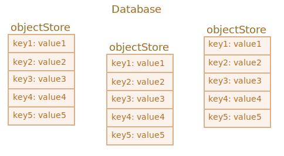

libs:
  - 'https://cdn.jsdelivr.net/npm/idb@3.0.2/build/idb.min.js'

---

# IndexedDB

IndexedDB — це база даних, вбудована в браузер, набагато потужніша, ніж `localStorage`.

- Зберігає майже будь-які значення за ключами, використовує кілька типів ключів.
- Підтримує транзакції для надійності.
- Підтримує запити за диапазоном ключів та індекси.
- Може зберігати набагато більші обсяги даних, ніж `localStorage`.

Ця потужність зазвичай надмірна для традиційних програм клієнт-сервер. IndexedDB призначена для автономних додатків для поєднання із ServiceWorkers та іншими технологіями.

Нативний інтерфейс для IndexedDB, описаний у специфікації <https://www.w3.org/TR/IndexedDB>, базується на подіях.

<<<<<<< HEAD
Ми також можемо використовувати `async/await` за допомогою обгортки на основі промісів, наприклад <https://github.com/jakearchibald/idb>. Це досить зручно, але обгортка не ідеальна, вона не може замінити події для всіх випадків. Отже, ми почнемо з подій, а потім, коли зрозуміємо IndexedDB, скористаємося обгорткою.
=======
We can also use `async/await` with the help of a promise-based wrapper, like <https://github.com/jakearchibald/idb>. That's pretty convenient, but the wrapper is not perfect, it can't replace events for all cases. So we'll start with events, and then, after we gain an understanding of IndexedDB, we'll use the wrapper.
>>>>>>> 5e893cffce8e2346d4e50926d5148c70af172533

```smart header="Де зберігаються дані?"
Технічно дані зазвичай зберігаються в домашньому каталозі відвідувача разом з налаштуваннями браузера, розширеннями тощо.

У різних браузерів і користувачів на рівні ОС є власне незалежне сховище.
```

## Відкрити базу даних

Щоб почати працювати з IndexedDB, нам спочатку потрібно `відкрити` (підключитися до) бази даних.

Синтаксис:

```js
let openRequest = indexedDB.open(name, version);
```

- `name` -- рядок, ім’я бази даних.

- `version` -- версія є цілим числом, типово `1` (пояснення нижче).

У нас може бути багато баз даних з різними іменами, але всі вони існують лише в межах поточного вебсайту (протокол/домен/порт). Різні вебсайти не мають доступу до баз даних один одного.

Виклик повертає об’єкт `openRequest`, ми повинні прослухати події на ньому:
- `success`: база даних готова, в `openRequest.result`є "об’єкт бази даних", ми повинні використовувати його для подальших викликів.
- `error`: не вдалося відкрити.
- `upgradeneeded`: база даних готова, але її версія застаріла (див. нижче).

**IndexedDB має вбудований механізм «cхему контролю версій», який відсутній у серверних базах даних.**

На відміну від серверних баз даних, IndexedDB є клієнтською, дані зберігаються в браузері, тому ми, розробники, не маємо до них постійного доступу. Отже, коли ми опублікували нову версію нашого застосунку, і користувач відвідує веб-сторінку, нам може знадобитися оновити базу даних.

Якщо версія локальної бази даних менша за вказану в `open`, тоді запускається спеціальна подія `upgradeneeded`, і ми можемо порівнювати версії та оновлювати структури даних за потребою.

Подія `upgradeneeded` також запускається, коли база даних ще не існує (технічно її версія дорівнює `0`), тому ми можемо виконати ініціалізацію.

Скажімо, ми опублікували першу версію нашого застосунку.

Тоді ми можемо відкрити базу даних з версією `1` та виконати ініціалізацію в обробнику `upgradeneeded`, таким чином:

```js
let openRequest = indexedDB.open("store", *!*1*/!*);

openRequest.onupgradeneeded = function() {
  // спрацьовує, якщо на клієнті немає бази даних
  // ...виконати ініціалізацію...
};

openRequest.onerror = function() {
  console.error("Error", openRequest.error);
};

openRequest.onsuccess = function() {
  let db = openRequest.result;
  // продовжити роботу з базою даних за допомогою об’єкта db
};
```

Потім, пізніше, ми публікуємо 2-у версію.

Ми можемо зробити це за допомогою версії `2` і виконати оновлення таким чином:

```js
let openRequest = indexedDB.open("store", *!*2*/!*);

openRequest.onupgradeneeded = function(event) {
  // існуюча версія бази даних менше 2 (або її не існує).
  let db = openRequest.result;
  switch(event.oldVersion) { // існуюча версія БД
    case 0:
      // версія 0 означає, що клієнт не мав бази даних
      // виконати ініціалізацію
    case 1:
      // клієнт мав версію 1
      // оновлення
  }
};
```

Зверніть увагу: оскільки наша поточна версія `2`, обробник `onupgradeneeded` що має гілку коду для версії `0`, підходить для користувачів, які звертаються вперше і не мають бази даних, а також для версії `1`, для оновлення.

І лише якщо обробник `onupgradeneeded` завершиться без помилок, запускається `openRequest.onsuccess`, і база даних вважається успішно відкритою.

Щоб видалити базу даних:

```js
let deleteRequest = indexedDB.deleteDatabase(name)
// deleteRequest.onsuccess/onerror відстежує результат
```

```warn header="Ми не можемо відкрити базу даних за допомогою виклику для відкриття старішої версії"
Якщо поточна база даних користувача має вищу версію, ніж у виклику "open", напр. існуюча версія БД `3`, а ми намагаємося викликати `open(...2)`, тоді це помилка, і запускається `openRequest.onerror`.

Це рідкість, але таке може статися, коли відвідувач завантажує застарілий код JavaScript, напр. з кешу проксі. Отже, код старий, але його база даних нова.

Щоб захиститися від помилок, ми повинні перевірити `db.version` і, якщо потрібно, запропонувати перезавантажити сторінку. Використовуйте правильні заголовки кешування HTTP, щоб уникнути завантаження старого коду та щоб у вас ніколи не виникло таких проблем.
```

### Проблема паралельного оновлення

Оскільки ми говоримо про версійність, давайте розглянемо невеличку проблему пов’язану з цим.

Скажімо:
1. Відвідувач відкрив наш сайт у вкладці браузера з версією бази даних `1`.
2. Потім ми випустили оновлення, тож наш код новіший.
3. А потім той же відвідувач відкриває наш сайт в іншій вкладці.

Отже, є вкладка з відкритим підключенням до БД версії `1`, а друга намагається оновити її до версії `2` у своєму обробнику `upgradeneeded`.

Проблема полягає в тому, що база даних є спільною між двома вкладками, оскільки це той самий сайт, з того самого джерела. І це не може бути одночасно версія `1` і `2`. Щоб виконати оновлення до версії `2`, усі підключення до версії `1` мають бути закриті, включно з підключенням на першій вкладці.

Щоб це організувати, подія `versionchange` запускається на "застарілому" об’єкті бази даних. Нам слід прислухатися до цього та закрити старе підключення до бази даних (і, ймовірно, запропонувати перезавантажити сторінку, щоб завантажити оновлений код).

Якщо ми не прослухаємо подію `versionchange` і не закриємо старе з’єднання, то друге, нове з’єднання не буде встановлено. Об’єкт `openRequest` видаватиме подію `blocked` замість `success`. Тому друга вкладка не працюватиме.

Ось код для правильної обробки паралельного оновлення. Він встановлює обробник `onversionchange`, який запускається, якщо поточне з’єднання з базою даних стає застарілим (версія db оновлюється в іншому місці), і закриває з’єднання.

```js
let openRequest = indexedDB.open("store", 2);

openRequest.onupgradeneeded = ...;
openRequest.onerror = ...;

openRequest.onsuccess = function() {
  let db = openRequest.result;

  *!*
  db.onversionchange = function() {
    db.close();
    alert("База даних застаріла, перезавантажте сторінку.")
  };
  */!*

  // ...БД готова, використовуйте її...
};

*!*
openRequest.onblocked = function() {
  // ця подія не має спрацьовувати, якщо ми правильно обробимо зміну версії

  // це означає, що є ще одне відкрите підключення до тієї ж бази даних
  // і воно не буде закрите після того, як для нього спрацьовує db.onversionchange
};
*/!*
```

...Інакше кажучи, тут ми робимо дві речі:

1. Слухач `db.onversionchange` повідомляє нас про спробу паралельного оновлення, якщо поточна версія бази даних стає застарілою.
2. Слухач `openRequest.onblocked` інформує нас про протилежну ситуацію: є підключення до застарілої версії в іншому місці, і воно не закривається, тому нове з’єднання неможливо встановити.

Ми можемо обробляти подібні речі більш витончено в `db.onversionchange`, запропонувати відвідувачу зберегти дані до закриття з’єднання.

Або, альтернативним підходом було б не закривати базу даних у `db.onversionchange`, а замість цього використовувати обробник `onblocked` (у новій вкладці), щоб попередити відвідувача про те, що новішу версію не можна завантажити, доки він не закриє іншу вкладку.

Ці зіткнення оновлень трапляються рідко, але ми повинні принаймні мати певну обробку для них, обробник `onblocked`, щоб запобігти безшумній смерті нашого сценарію.

## Сховище об’єктів

Щоб зберегти щось у IndexedDB, нам потріне *сховище об’єктів*.

Сховище об’єктів є основною концепцією IndexedDB. Аналоги в інших базах даних називаються «таблицями» або «колекціями». Саме там зберігаються дані. База даних може мати кілька сховищ: одне для користувачів, інше для товарів тощо.

Незважаючи на те, що це називають «сховищем об’єктів», примітиви також можна зберігати.

**Ми можемо зберігати практично будь-які значення, включаючи складні об’єкти.**

IndexedDB використовує [стандартний алгоритм серіалізації](https://www.w3.org/TR/html53/infrastructure.html#section-structuredserializeforstorage) щоб клонувати та зберігати об’єкт. Це як `JSON.stringify`, але потужніший, здатний зберігати набагато більше типів даних.

Приклад об’єкта, який не можливо зберегти: об’єкт з круговими посиланнями. Такі об’єкти не можна серіалізувати. `JSON.stringify` також не придатний для таких об’єктів.

**Для кожного значення в сховищі має бути унікальний "ключ".**     

Ключ повинен бути одним з цих типів - число, дата, рядок, двійковий або масив. Це унікальний ідентифікатор, тому ми можемо шукати/видаляти/оновлювати значення за ключем.



Як побачимо незабаром, ми можемо надати ключ, коли додамо значення до сховища, подібне до `localStorage`. Але коли ми зберігаємо об’єкти, IndexedDB дозволяє налаштувати властивість об’єкта як ключ, що набагато зручніше. Або ми можемо автоматично згенерувати ключі.

Але спочатку нам потрібно створити сховище об’єктів.

Синтаксис створення сховища об’єктів:

```js
db.createObjectStore(name[, keyOptions]);
```

Зауважте, що операція синхронна, та не потребує `await`.

- `name` -- назва сховища, наприклад. `"books"` для книжок,
- `keyOptions` є необов’язковим об’єктом з однією з двох властивостей:
  - `keyPath` -- шлях до властивості об’єкта, який IndexedDB використовуватиме як ключ, напр. `id`.
  - `autoIncrement` -- якщо `true`, тоді ключ для щойно збереженого об’єкта генерується автоматично у вигляді постійно зростаючого числа.

Якщо ми не постачаємо `keyOptions`, тоді нам потрібно буде надати ключ явно пізніше, коли будемо зберігати об’єкт.

Наприклад, це сховище об’єктів використовує властивість `id` як ключ:

```js
db.createObjectStore('books', {keyPath: 'id'});
```

**Сховище об’єктів можна створити/змінити лише під час оновлення версії БД в обробнику `upgradeneeded`.**

Це технічне обмеження. За межами обробника ми зможемо додавати/вилучати/оновлювати дані, але сховища об’єктів можна створювати/вилучати/змінювати лише під час оновлення версії.

Щоб виконати оновлення версії бази даних, існує два основних підходи:

1. Ми можемо реалізувати функції оновлення для кожної версії: від 1 до 2, від 2 до 3, від 3 до 4 тощо. Потім у `upgradeneeded` ми можемо порівняти версії (наприклад, стару 2, тепер 4) та запустити крок оновлення для кожної версії покроково, для кожної проміжної версії (2 до 3, потім від 3 до 4).
2. Або ми можемо просто перевірити базу даних: отримати список існуючих сховищ об’єктів як `db.objectStoreNames`. Цим об’єктом є [DOMStringList](https://html.spec.whatwg.org/multipage/common-dom-interfaces.html#domstringlist) який надає метод `contains(name)` для перевірки існування. А потім ми можемо виконувати оновлення залежно від того, що існує, а що ні.

Для невеликих баз даних другий варіант може бути простішим.

Ось демонстрація другого підходу:

```js
let openRequest = indexedDB.open("db", 2);

// створити/оновити базу даних без перевірки версій
openRequest.onupgradeneeded = function() {
  let db = openRequest.result;
  if (!db.objectStoreNames.contains('books')) { // якщо не існує сховища "books"
    db.createObjectStore('books', {keyPath: 'id'}); // створити його
  }
};
```

Щоб видалити сховище об’єктів:

```js
db.deleteObjectStore('books')
```

## Транзакції

Термін "транзакція" є загальним і використовується в багатьох видах баз даних.

Транзакція — це група операцій, які повинні або всі завершитися успішно, або всі невдало.

Наприклад, коли людина щось купує, нам потрібно:

1. Відняти гроші з рахунку.
2. Додати товар до списку.

Було б дуже прикро, якби ми завершили 1-у операцію, а потім щось пішло не так, напр. трапилася помилка, і ми не можемо виконати 2-у операцію. Обидві мають досягти успіху (купівля завершена, добре!), або обидві потерпіли невдачу (принаймні, людина залишила свої гроші, щоб повторити спробу).

Це можуть гарантувати транзакції.

**Усі операції з даними повинні виконуватися в рамках транзакції в IndexedDB.**

Почати транзакцію:

```js
db.transaction(store[, type]);
```

- `store` це назва сховища, до якого має отримати доступ транзакція, напр. `"books"`. Це може бути масив імен сховищ, якщо ми збираємося отримати доступ до кількох сховищ.
- `type` – тип транзакції, один з:
  - `readonly` -- може лише читати дані, типово.
  - `readwrite` -- може лише читати та записувати дані, але не створювати/видаляти/змінювати сховища об’єктів.

Існує також тип транзакції `versionchange`: такі транзакції можуть робити все, але ми не можемо створити їх вручну. IndexedDB автоматично створює транзакцію `versionchange` під час відкриття бази даних для обробника `updateneeded`. Тому це єдине місце, де ми можемо оновлювати структуру бази даних, створювати/видаляти сховища об’єктів.

```smart header="Чому існують різні види транзакцій?"
Продуктивність є причиною, чому транзакції мають бути позначені як `readonly` та `readwrite`. 

Багато `readonly` транзакцій можуть отримати доступ до того самого сховища одночасно, але `readwrite` транзакції - не можуть. Транзакція `readwrite` "блокує" сховище для запису. Наступна транзакція повинна почекати до завершення попередньої, перш ніж отримати доступ до того самого сховища.
```

Після створення транзакції ми можемо додати елемент до сховища, ось так:

```js
let transaction = db.transaction("books", "readwrite"); // (1)

// отримати сховище об’єктів для роботи з ним
*!*
let books = transaction.objectStore("books"); // (2)
*/!*

let book = {
  id: 'js',
  price: 10,
  created: new Date()
};

*!*
let request = books.add(book); // (3)
*/!*

request.onsuccess = function() { // (4)
  console.log("Книгу додано в сховище", request.result);
};

request.onerror = function() {
  console.log("Помилка", request.error);
};
```

Ось чотири основні кроки:

1. Створіть транзакцію, вказавши всі сховища, в які вона збирається отримати доступ `(1)`.
2. Отримайте об’єкт магазину за допомогою `transaction.objectStore(name)` `(2)`.
3. Виконайте запит до сховища об’єктів `books.add(book)` `(3)`.
4. ...Обробіть запит успішно/помилка `(4)`, потім можливо робити інші запити, якщо потрібно.

Сховища об’єктів підтримують два методи збереження значення:

- **put(value, [key])**
    Додайте `value` до сховища. `Key` надається лише в тому випадку, якщо в сховищі об’єктів не було параметра `keyPath` або `autoIncrement`. `keyPath` чи `autoIncrement` опція. Якщо вже є значення з таким самим ключем, воно буде замінено.

- **add(value, [key])**
    Те саме що `put`, але якщо вже є значення з тим самим ключем, запит не вдається, і генерується помилка з назвою `"ConstraintError"`.

Подібно до відкриття бази даних, ми можемо відправити запит: `books.add(book)`, а потім чекати події `success/error`.

- `request.result` для `add` є ключем нового об’єкта.
- Помилкою, якщо є, буде `request.error`.

## Автозавершення транзакцій

У наведеному вище прикладі ми запустили транзакцію та зробили запит на додавання. Але, як ми зазначали раніше, транзакція може мати кілька пов’язаних запитів, усі вони повинні бути успішними або невдалими. Як позначити транзакцію як завершену, без запитів?

Коротка відповідь: це не потрібно.

У наступній версії специфікації 3.0, ймовірно, буде ручний спосіб завершити транзакцію, але зараз у 2.0 його немає.

**Коли всі запити транзакції завершено, а [черга мікрозадач](info:microtask-queue) порожня, вона завершується автоматично.**

Зазвичай ми можемо припустити, що транзакція завершується, коли всі її запити завершені, а поточний код виконаний.

Отже, у наведеному вище прикладі не потрібен особливий виклик для завершення транзакції.

Принцип автозавершення транзакцій має важливий побічний ефект. Ми не можемо вставити асинхронну операцію, як-от `fetch`, `setTimeout`, у середину транзакції. IndexedDB не буде чекати транзакцію, поки вона не виконана.

У наведеному нижче коді `request2` у рядку `(*)` не працює, оскільки транзакція вже завершена, і в ній не можливо зробити жодного запиту:

```js
let request1 = books.add(book);

request1.onsuccess = function() {
  fetch('/').then(response => {
*!*
    let request2 = books.add(anotherBook); // (*)
*/!*
    request2.onerror = function() {
      console.log(request2.error.name); // TransactionInactiveError
    };
  });
};
```

Це тому, що `fetch` є асинхронною операцією, макрозавданням. Трансакції закриваються до того, як браузер почне виконувати макрозавдання.

Автори специфікації IndexedDB вважають, що транзакції мають бути короткочасними. В основному з міркувань продуктивності.

Примітно, що транзакції `readwrite` "блокують" сховища для запису. Отже, якщо одна частина програми ініціювала `readwrite` у сховищі об’єктів `books`, тоді інша частина, яка хоче зробити те ж саме, повинна почекати: нова транзакція "зависає", доки не буде виконана перша. Це може призвести до дивних затримок, якщо транзакції займають багато часу.

Отже, що робити?

У наведеному вище прикладі ми могли б створити новий `db.transaction` безпосередньо перед новим запитом `(*)`.

Але буде ще краще, якщо ми захочемо зберегти операції разом, в одній транзакції, розділити транзакції IndexedDB та «інші» асинхронні речі.

Спочатку зробіть `fetch`, підготуйте дані, якщо потрібно, потім створіть транзакцію та виконайте всі запити до бази даних, тоді це запрацює.

Щоб визначити момент успішного завершення, ми можемо прослухати подію `transaction.oncomplete`:

```js
let transaction = db.transaction("books", "readwrite");

// ...виконувати операції...

transaction.oncomplete = function() {
  console.log("Транзакція завершена");
};
```

Тільки `complete` гарантує, що транзакція буде збережена в цілому. Окремі запити можуть бути успішними, але остаточна операція запису може піти не так (наприклад, помилка введення-виводу чи щось подібне).

Щоб вручну припинити транзакцію, викличте:

```js
transaction.abort();
```

Це скасовує всі зміни, зроблені запитами, і запускає подію `transaction.onabort`.


## Обробка помилок

Запити на запис можуть не виконуватися.

Цього можна очікувати не лише через можливі помилки з нашого боку, а й з причин, не пов’язаних із самою транзакцією. Наприклад, закінчилося пам’ять. Тож ми повинні бути готові впоратися з такою справою.

**Невдалий запит автоматично перериває транзакцію, скасовуючи всі зміни.**

У деяких ситуаціях ми можемо забажати обробити помилку (наприклад, спробувати інший запит), не скасовуючи наявні зміни, і продовжити транзакцію. Це можливо. Обробник `request.onerror` може запобігти перериванню транзакції, викликавши `event.preventDefault()`.

У наведеному нижче прикладі додається нова книга з тим самим ключем (`id`), що й існуюча. У цьому випадку метод `store.add` генерує "ConstraintError". Ми обробляємо це, не скасовуючи транзакцію:

```js
let transaction = db.transaction("books", "readwrite");

let book = { id: 'js', price: 10 };

let request = transaction.objectStore("books").add(book);

request.onerror = function(event) {
  // ConstraintError виникає, коли об’єкт з таким же ідентифікатором вже існує
  if (request.error.name == "ConstraintError") {
    console.log("Книга з таким ідентифікатором вже існує"); // обробіть помилку
    event.preventDefault(); // запобігаємо скасуванню транзакції
    // використовувати інший ключ для книги?
  } else {
    // несподівана помилка, не можу впоратися з нею
    // транзакція буде перервана
  }
};

transaction.onabort = function() {
  console.log("Помилка", transaction.error);
};
```

### Делегування події

Чи потрібно нам onerror/onsuccess для кожного запиту? Не завжди. Замість цього ми можемо використовувати делегування подій.

**Спливаюча подія IndexedDB: `запит` -> `транзакція` -> `база даних`.**

Всі події є DOM-подіями з фазами перехоплення та спливання, але зазвичай використовується тільки спливання.

Тож ми можемо відловити всі помилки за допомогою обробника `db.onerror` для звітів чи інших цілей:

```js
db.onerror = function(event) {
  let request = event.target; // запит, який спричинив помилку

  console.log("Помилка", request.error);
};
```

...Але що, якщо помилка повністю оброблена? Ми не хочемо повідомляти про це в такому випадку.

Ми можемо зупинити спливання і, відповідно, `db.onerror`, використовуючи `event.stopPropagation()` у `request.onerror`.

```js
request.onerror = function(event) {
  if (request.error.name == "ConstraintError") {
    console.log("Книга з таким ідентифікатором вже існує"); // обробіть помилку
    event.preventDefault(); // запобігаємо скасуванню транзакції
    event.stopPropagation(); // запобігаємо спливанню помилки
  } else {
    // нічого не робимо
    // транзакція буде скасована
    // ми можемо подбати про помилку в transaction.onabort
  }
};
```

## Пошук

Існує два основних типи пошуку в сховищі об’єктів:

1. За значенням ключа або діапазоном ключа. У нашому сховищі «книги» це буде значення або діапазон значень `book.id`.
2. За іншим полем об’єкта, напр. `book.price`. Для цього потрібна додаткова структура даних під назвою «index».

### За ключем

Спочатку розберемося з першим типом пошуку: за ключем.

Методи пошуку підтримують як точні значення ключів, та так звані "діапазони значень" -- [IDBKeyRange](https://www.w3.org/TR/IndexedDB/#keyrange) об’єкти, які визначають прийнятний "діапазон ключів".

Об’єкти `IDBKeyRange` створюються за допомогою наступних викликів:

- `IDBKeyRange.lowerBound(lower, [open])` означає: `≥lower` (чи `>lower` якщо `open` є істина)
- `IDBKeyRange.upperBound(upper, [open])` означає: `≤upper` (чи `<upper` якщо `open` є істина)
- `IDBKeyRange.bound(lower, upper, [lowerOpen], [upperOpen])` означає: поміж `lower` та `upper`. Якщо прапори open істинні, відповідний ключ не входить до діапазону.
- `IDBKeyRange.only(key)` -- діапазон, який складається лише з одного `ключа`, рідко використовується.

Зовсім скоро ми побачимо практичні приклади їх використання.

Для здійснення фактичного пошуку існують такі методи. Вони приймають аргумент `query`, який може бути точним ключем або діапазоном ключів:

- `store.get(query)` -- пошук першого значення за ключем або діапазоном.
- `store.getAll([query], [count])` -- шукати всі значення, обмежуючись `count`, якщо вказано.
- `store.getKey(query)` -- пошук першого ключа, який задовольняє запиту, зазвичай діапазон.
- `store.getAllKeys([query], [count])` -- пошук усіх ключів, які задовольняють запиту, зазвичай діапазону, до `count`, якщо вказано.
- `store.count([query])` -- отримати загальну кількість ключів, які задовольняють запиту, зазвичай діапазон.

Наприклад, у нас в магазині багато книг. Пам’ятайте, що поле `id` є ключем, тому всі ці методи можуть здійснювати пошук за `id`.

Приклади запитів:

```js
// отримати одну книгу
books.get('js')

// отримати книги з 'css' <= id <= 'html'
books.getAll(IDBKeyRange.bound('css', 'html'))

// отримати книги з id < 'html'
books.getAll(IDBKeyRange.upperBound('html', true))

// отримати всі книги
books.getAll()

// отримати всі ключи, де id > 'js'
books.getAllKeys(IDBKeyRange.lowerBound('js', true))
```

```smart header="Сховище об’єктів завжди відсортовано"
Сховище об’єктів внутрішньо сортує значення за ключем.

Тому запити, які повертають багато значень, завжди повертають їх у відсортованому за ключем порядку.
```

### За полем за допомогою індексу

Для пошуку за іншими полями об’єкта нам потрібно створити додаткову структуру даних під назвою «індекс».

Індекс — це «доповнення» до сховища, яке відстежує дане поле об’єкта. Для кожного значення цього поля він зберігає список ключів для об’єктів, які мають це значення. Нижче буде більш детальна картинка.

Синтаксис:

```js
objectStore.createIndex(name, keyPath, [options]);
```

- **`name`** -- ім’я індексу,
- **`keyPath`** -- шлях до поля об’єкта, яке має відстежувати індекс (ми будемо шукати за цим полем),
- **`option`** -- необов’язковий об’єкт з властивостями:
  - **`unique`** -- якщо значення true, то в сховищі може бути лише один об’єкт із заданим значенням у `keyPath`. Індекс забезпечить це, генеруючи помилку, якщо ми спробуємо додати дублікат.
  - **`multiEntry`** -- використовується лише якщо значення `keyPath` є масивом. У цьому випадку індекс розглядатиме весь масив як ключ. Але якщо `multiEntry` має значення true, то індекс зберігатиме список об’єктів сховища для кожного значення в цьому масиві. Таким чином, члени масиву стають ключами індексу.

У нашому прикладі ми зберігаємо книги з ключем `id`.

Скажімо, ми хочемо шукати за `price`.

Спочатку нам потрібно створити індекс. Це потрібно зробити в `upgradeneeded`, як у сховищі об’єктів:

```js
openRequest.onupgradeneeded = function() {
  // ми повинні створити індекс тут, у транзакції зміни версії
  let books = db.createObjectStore('books', {keyPath: 'id'});
*!*
  let index = books.createIndex('price_idx', 'price');
*/!*
};
```

- Індекс буде відстежувати поле `price`.
- Ціна не є унікальною, може бути кілька книг з однаковою ціною, тому ми не встановлюємо параметр `unique`.
- Ціна не є масивом, тому прапор `multiEntry` не застосовується.

Уявіть собі, що в нашому `inventory` є 4 книги. Ось малюнок, який показує, що саме таке `index`.


Як сказано, індекс для кожного значення `price` (другий аргумент) зберігає список ключів, які мають таку ціну.

Індекс оновлюється автоматично, нам не потрібно дбати про це.

Тепер, коли ми хочемо шукати за заданою ціною, ми просто застосовуємо ті самі методи пошуку до індексу:

```js
let transaction = db.transaction("books"); // readonly
let books = transaction.objectStore("books");
let priceIndex = books.index("price_idx");

*!*
let request = priceIndex.getAll(10);
*/!*

request.onsuccess = function() {
  if (request.result !== undefined) {
    console.log("Книги", request.result); // масив книг із ціною=10
  } else {
    console.log("Немає таких книжок");
  }
};
```

Ми також можемо використовувати `IDBKeyRange` для створення діапазонів і пошуку дешевих/дорогих книг:

```js
// знайти книги, де ціна <= 5
let request = priceIndex.getAll(IDBKeyRange.upperBound(5));
```

Індекси внутрішньо відсортовані за полем відстежуваного об’єкта, у нашому випадку `price`. Тому, коли ми виконуємо пошук, результати також сортуються за `price`.

## Видалення зі сховища

Метод `delete` шукає значення для видалення за запитом, формат виклику подібний до `getAll`:

- **`delete(query)`** -- видалити відповідні значення за запитом.

Наприклад:

```js
// видалити книгу з id='js'
books.delete('js');
```

Якщо ми хочемо видалити книги на основі ціни або іншого поля об’єкта, то спочатку ми повинні знайти ключ в індексі, а потім викликати `delete`:

```js
// знайти ключ з price = 5
let request = priceIndex.getKey(5);

request.onsuccess = function() {
  let id = request.result;
  let deleteRequest = books.delete(id);
};
```

Щоб видалити все:

```js
books.clear(); // очистити сховище.
```

## Курсори

Такі методи, як `getAll/getAllKeys` повертають масив ключів/значень.

Але сховище об’єктів може бути величезним, більшим за доступну пам’ять. Тоді `getAll` не зможе отримати всі записи у вигляді масиву.

Що робити?

Курсори забезпечують засоби, щоб обійти це.

**Об’єкт *cursor* — це спеціальний об’єкт, який обходить сховище об’єктів за запитом і повертає один ключ/значення за раз, економлячи таким чином пам’ять.**

Оскільки сховище об’єктів внутрішньо відсортовано за ключем, курсор проходить по сховищу в порядку знаходження ключа (типово за зростанням).

Синтаксис:

```js
// як getAll, але з використанням курсору:
let request = store.openCursor(query, [direction]);

// отримати ключі, не значення (як getAllKeys): store.openKeyCursor
```

- **`query`** є ключем або діапазоном ключів, як і для `getAll`.
- **`direction`** є необов’язковим аргументом, що вказує який порядок використовувати:
 - `"next"` -- типово, курсор піднімається від найнижчого ключа до найвищчого.
 - `"prev"` -- зворотний порядок: вниз від запису з найбільшим ключем.
 - `"nextunique"`, `"prevunique"` -- те саме, що й вище, але пропускає записи з тим же ключем, який вже був (лише для курсорів за індексами, наприклад, для кількох книг із ціною=5 буде повернута лише перша).

**Основна відмінність курсору полягає в тому, що `request.onsuccess` запускається кілька разів: один раз для кожного результату.**

Ось приклад того, як використовувати курсор:

```js
let transaction = db.transaction("books");
let books = transaction.objectStore("books");

let request = books.openCursor();

// викликається для кожної книги, знайденої курсором
request.onsuccess = function() {
  let cursor = request.result;
  if (cursor) {
    let key = cursor.key; // ключ книги (поле id)
    let value = cursor.value; // книжковий об’єкт
    console.log(key, value);
    cursor.continue();
  } else {
    console.log("Книг більше немає");
  }
};
```

Основними методами курсора є:

- `advance(count)` -- пересунути курсор `count` разів, пропускаючи значення.
- `continue([key])` -- пересунути курсор до наступного значення у відповідності з діапазоном (або відразу після `key`, якщо вказано).

Незалежно від того, чи є значення, що відповідають курсору, чи ні – викликається `onsuccess`, а потім у `result` ми можемо отримати курсор, що вказує на наступний запис, або `undefined`.

У наведеному вище прикладі курсор був створений для сховища об’єктів.

Але ми також можемо навести курсор на індекс. Як ми пам’ятаємо, індекси дозволяють здійснювати пошук по полю об’єкта. Курсори над індексами діють точно так само, як і над сховищами об’єктів — вони економлять пам’ять, повертаючи по одному значенню за раз.

Для курсорів над індексами `cursor.key` є ключем індексу (наприклад, ціна), і ми повинні використовувати властивість `cursor.primaryKey` для ключа об’єкта:

```js
let request = priceIdx.openCursor(IDBKeyRange.upperBound(5));

// викликані для кожного запису
request.onsuccess = function() {
  let cursor = request.result;
  if (cursor) {
    let primaryKey = cursor.primaryKey; // ключ сховища наступного об’єкта (поле id)
    let value = cursor.value; // наступний об’єкт сховища (об’єкт книги)
    let key = cursor.key; // наступний ключ індексу (price)
    console.log(key, value);
    cursor.continue();
  } else {
    console.log("Книг більше немає");
  }
};
```

## Обгортка промісів

Додавання `onsuccess/onerror` до кожного запиту є досить громіздким завданням. Іноді ми можемо полегшити життя, використовуючи делегування подій, напр. встановити обробники для всіх транзакцій, але `async/await` набагато зручніше. 

Давайте використаємо тонку обгортку промісів <https://github.com/jakearchibald/idb> далі в цьому розділі. Вона створює глобальний об’єкт `idb` з методами IndexedDB [promisified](info:promisify).

Тоді замість `onsuccess/onerror` ми можемо написати так:

```js
let db = await idb.openDB('store', 1, db => {
  if (db.oldVersion == 0) {
    // виконати ініціалізацію
    db.createObjectStore('books', {keyPath: 'id'});
  }
});

let transaction = db.transaction('books', 'readwrite');
let books = transaction.objectStore('books');

try {
  await books.add(...);
  await books.add(...);

  await transaction.complete;

  console.log('jsbook saved');
} catch(err) {
  console.log('error', err.message);
}
```

Тож маємо все солоденьке «простий асинхронний код» та "try..catch".

### Обробка помилок

Якщо ми не ловимо помилку, вона провалюється до найближчого зовнішнього `try..catch`.

Невиявлена помилка стає подією "необробленого відхилення промісу" на об’єкті `window`.

Ми можемо обробляти такі помилки таким чином:

```js
window.addEventListener('unhandledrejection', event => {
  let request = event.target; // Власний об’єкт запиту IndexedDB
  let error = event.reason; //  Необроблений об’єкт помилки, те саме, що request.error
  ...повідомити про помилку...
});
```

### Підводний камінь «Неактивна транзакція».

Як ми вже знаємо, транзакція автоматично завершується, як тільки браузер закінчить роботу з поточним кодом і мікрозавданнями. Отже, якщо ми помістимо *макрозавдання* на кшталт `fetch` в середині транзакції, то транзакція не чекатиме завершення. Вона просто автоматично завершається. Отже, наступний запит буде невдалим.

Для обгортки промісів і `async/await` ситуація однакова.

Ось приклад `fetch` у середині транзакції:

```js
let transaction = db.transaction("inventory", "readwrite");
let inventory = transaction.objectStore("inventory");

await inventory.add({ id: 'js', price: 10, created: new Date() });

await fetch(...); // (*)

await inventory.add({ id: 'js', price: 10, created: new Date() }); // Помилка
```

Наступний `inventory.add` після `fetch` `(*)` не вдається з помилкою "неактивна транзакція", оскільки на той момент транзакція вже завершена та закрита.

Обхідний шлях такий же, як і під час роботи з рідною IndexedDB: або зробіть нову транзакцію, або просто розділіть речі.

1. Підготуйте дані та спершу отримайте все необхідне.
2. Потім збережіть у базі даних.

### Отримання вбудованих об’єктів

Внутрішньо обгортка виконує запит IndexedDB, додаючи до нього `onerror/onsuccess`, і повертає проміс, який відхиляється/розв’язується з результатом.

Це добре працює більшість часу. Приклади є на сторінці lib <https://github.com/jakearchibald/idb>.

У кількох рідкісних випадках, коли нам потрібен оригінальний об’єкт `request`, ми можемо отримати до нього доступ як властивості `promise.request` промісу:

```js
let promise = books.add(book); // отримати проміс (не чекаємо результату)

let request = promise.request; // вбудований об’єкт запиту
let transaction = request.transaction; // вбудований об’єкт транзакції

// ...працюємо з IndexedDB...

let result = await promise; // якщо ще потрібно
```

## Підсумки

IndexedDB можна розглядати як «локальне сховище на стероїдах». Це проста база даних ключ-значення, достатньо потужна для автономних програм, але проста у використанні.

Найкращий посібник — це специфікація. [Поточна](https://www.w3.org/TR/IndexedDB-2/) версія 2.0, але кілька методів із [3.0](https://w3c.github.io/IndexedDB/) (це мало чим відрізняється) частково підтримуються.

Використання можна описати кількома фразами:

1. Підключити обгортку над промісами, наприклад [idb](https://github.com/jakearchibald/idb).
2. Відкрити базу даних: `idb.openDb(name, version, onupgradeneeded)`
    - Створити сховища об’єктів та індекси в обробнику `onupgradeneeded` або виконати оновлення версії, якщо потрібно.
3. Для запитів:
    - Створити транзакцію `db.transaction('books')` (можна вказати readwrite якщо потрібно).
    - Отримати сховище об’єктів `transaction.objectStore('books')`.
4. Потім для пошуку за ключем викликати методи безпосередньо в сховищі об’єктів.
    - Для пошуку по полю об’єкта потрібно створити індекс.
5. Використовувати курсор, якщо дані не поміщаються в пам’ять.

Ось невелика демонстраційна програма:

[codetabs src="books" current="index.html"]
