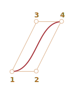

# Крива Безьє

Криві Безьє використовують у комп'ютерній графіці для малювання гладких фігур, для CSS-анімації та у багатьох інших випадках.

Це дуже проста річ, яку варто дослідити один раз, щоб надалі комфортно почуватись у світі векторної графіки та просунутих анімацій.

```smart header="Трохи теорії, будь ласка"
Ця стаття містить теоретичне, але дуже необхідне розуміння того, що таке криві Безьє, а [наступна](info:css-animations#bezier-curve) показує, як ми можемо використовувати їх для CSS анімацій.

Будь ласка, не поспішайте, щоб прочитати та зрозуміти концепцію, вона вам добре послужить.
```

## Контрольні точки

[Крива Безьє](https://uk.wikipedia.org/wiki/Крива_Безьє) задається контрольними точками.

Їх може бути 2, 3, 4 або й більше.

Ось, наприклад, крива з двома опорними точками:


Крива з трьома точками:


Крива з чотирма точками:


Якщо придивитись до цих кривих, можна одразу помітити наступне:

1. **Точки не завжди знаходяться на кривій.** Це цілком нормально, як саме будується крива ми побачимо пізніше.
2. **Ступінь кривої дорівнює кількості точок мінус один**.
Дві точки дають лінійну криву (по суті пряму лінію), три точки -- квадратичну криву (параболу), чотири точки -- кубічну криву.
3. **Крива завжди знаходиться всередині [опуклої оболонки](https://uk.wikipedia.org/wiki/Опукла_оболонка), що утворена контрольними точками:**

     

Остання властивість дозволяє оптимізувати пошук перетинів у комп'ютерній графіці. Криві не перетинаються, якщо їх опуклі оболонки не перетинаються. Тож попередня перевірка на перетин опуклих оболонок може вказати на відсутність перетину. Перевірка перетину опуклих оболонок значно легша, оскільки вони мають форму чотирикутника, трикутника тощо (дивіться малюнок вище), значно простіші фігури, ніж сама крива.

**Головна цінність кривих Безьє для малювання в тому, що пересування контрольних точок змінює криву *інтуїтивно зрозумілим чином*.**

Спробуйте пересунути контрольні точки за допомогою миші в наступній демонстрації:

[iframe src="demo.svg?nocpath=1&p=0,0,0.5,0,0.5,1,1,1" height=370]

**Як ви могли помітити, крива простягається вздовж дотичних ліній 1 -> 2 та 3 -> 4.**

Після невеликої практики стає зрозуміло, як розташувати точки, щоб отримати бажану форму. А поєднавши декілька кривих ми можемо отримати практично будь-що.

Ось деякі приклади:

  

## Алгоритм де Кастельє

Існує математична формула для кривих Безьє, але давайте розглянемо її трохи пізніше, оскільки
[Алгоритм де Кастельє](https://uk.wikipedia.org/wiki/Алгоритм_де_Кастельє) ідентичний математичному визначенню і наглядно показує, як вона будується.

Для початку давайте розглянемо приклад з трьох точок.

Ось демонстрація, а після неї буде пояснення.

Контрольні точки (1, 2 і 3) можна посунути мишею. Натисніть кнопку "play", щоб запустити її.

[iframe src="demo.svg?p=0,0,0.5,1,1,0&animate=1" height=370]

**Алгоритм де Кастельє для побудови кривої Безьє з трьох точок:**

1. Намалюймо контрольні точки. У прикладі вище вони позначені як `1`, `2`, `3`.
2. Побудуємо відрізки між контрольними точками 1 -> 2 -> 3. У прикладі вище вони <span style="color:#825E28">коричневі</span>.
3. Параметр `t` рухається від `0` до `1`. Приклад вище використовує крок `0.05`: циклічно отримуємо значення `0, 0.05, 0.1, 0.15, ... 0.95, 1`.

    Для кожного з цих значень `t`:

    - На кожному <span style="color:#825E28">коричневому</span> відрізку ми відкладаємо точку, що знаходиться на відстані від початку пропорційній до `t`. Оскільки відрізків два, ми отримуємо дві точки.

        Наприклад, для `t=0` -- обидві точки будуть на початку відрізка, для `t=0.25` -- на відстані 25% довжини відрізка від початку, для `t=0.5` -- 50% (на середині), для `t=1` -- в кінці відрізка.

    - З'єднаймо ці точки. На зображенні нижче цей відрізок має <span style="color:#167490">синій</span> колір.


| Для `t=0.25`             | Для `t=0.5`            |
| ------------------------ | ---------------------- |
|    |  |

4. Тепер на <span style="color:#167490">синьому</span> відрізку знайдемо точку на відстані пропорційній до значення `t`. Тобто для `t=0.25` (зображення ліворуч) ми отримуємо точку в кінці лівої чверті відрізку, а для `t=0.5` (зображення праворуч) -- посередині відрізка. На зображенні вище ця точка <span style="color:red">червона</span>.

5. Поки `t` проходить від `0` до `1`, кожне значення `t` додає одну точку до кривої. Множина таких точок утворює криву Безьє. Це <span style="color:red">червона</span> парабола на малюнку вгорі.

Це був процес для 3 точок. Але те саме стосується і 4 точок.

Демонстрація для 4 точок (точки можна рухати за допомогою миші):

[iframe src="demo.svg?p=0,0,0.5,0,0.5,1,1,1&animate=1" height=370]

Алгоритм для 4 точок:

- Поєднаймо контрольні точки відрізками: 1 -> 2, 2 -> 3, 3 -> 4. Отримаємо 3 <span style="color:#825E28">коричневі</span> відрізки.
- Для кожного `t` у інтервалі від `0` до `1`:
    - Ми беремо точки на цих відрізках на відстані від початку пропорційній до `t`. З'єднаємо ці точки, що дає нам два <span style="color:#0A0">зелених відрізки</span>.
    - На цих відрізках ми беремо точки, що пропорційні до `t`. Отримуємо <span style="color:#167490">синій відрізок</span>.
    - На синьому відрізку беремо точку, що пропорційна до `t`. У попередньому прикладі вона <span style="color:red">червоного</span> кольору.
- Разом ці точки утворюють криву.

Алгоритм рекурсивний і може бути узагальненим для будь-якої кількості контрольних точок.

Для N контрольних точок:

1. Ми поєднуємо їх, щоб отримати початкові N-1 відрізки.
2. Потім для кожного `t` від `0` до `1`, ми беремо точку у кожному відрізку на відстані, що пропорційна до `t` і поєднуємо їх. Це нам дасть N-2 нових відрізків.
3. Повторюємо крок 2 доки не залишиться лише одна точка.

Ці точки утворюють криву.

```online
**Запускайте і зупиняйте приклади, щоб ясніше побачити відрізки і те, яким чином вибудовується крива.**
```


Крива, що виглядає як `y=1/t`:

[iframe src="demo.svg?p=0,0,0,0.75,0.25,1,1,1&animate=1" height=370]

Контрольні точки у формі зиг-загу також добре спрацьовують:

[iframe src="demo.svg?p=0,0,1,0.5,0,0.5,1,1&animate=1" height=370]

Можна зробити петлю:

[iframe src="demo.svg?p=0,0,1,0.5,0,1,0.5,0&animate=1" height=370]

Негладка крива Безьє (так, це теж можливо):

[iframe src="demo.svg?p=0,0,1,1,0,1,1,0&animate=1" height=370]

```online
Якщо щось не зрозуміло в описі алгоритму, запустіть "живі" приклади вище, щоб розібратись, як саме
будується крива.
```

Оскільки алгоритм рекурсивний, ми можемо побудувати криву Безьє будь-якого ступеню, тобто з використанням 5, 6 або й більше контрольних точок. На практиці велика кількість точок не приносить користі. Зазвичай використовується 2-3 точки, а для складних ліній "склеюють" декілька кривих в одну. Це простіше для розробки і розрахунків.

```smart header="Як намалювати криву, що проходить *крізь* задані точки?"
Для задання кривої Безьє використовуються контрольні точки. Як ми бачимо, вони не знаходяться на кривій, окрім першої і останньої.

Інколи ми маємо інше завдання: намалювати криву, що *проходить крізь декілька точок*, тобто всі точки знаходяться на одній гладкій кривій. Ця задача називається [інтерполяцією](https://uk.wikipedia.org/wiki/Інтерполяція), і тут ми не будемо її розглядати.

Для таких кривих існують математичні формули, наприклад [многочлен Лагранжа](https://uk.wikipedia.org/wiki/Многочлен_Лагранжа). У комп'ютерній графіці для побудови гладких кривих, які поєднують багато точок, використовується [інтерполяція кубічними сплайнами](https://uk.wikipedia.org/wiki/Кубічний_сплайн).
```


## Математика

Криву Безьє можна описати за допомогою математичної формули.

Як ми побачили -- насправді її не потрібно знати, більшість людей просто малюють криву пересуваючи точки за допомогою миші. Але якщо ви захоплюєтесь математикою -- ось вона.

Нехай <code>P<sub>i</sub></code> -- це координати контрольних точок. Перша контрольна точка має координати <code>P<sub>1</sub> = (x<sub>1</sub>, y<sub>1</sub>)</code>, друга: <code>P<sub>2</sub> = (x<sub>2</sub>, y<sub>2</sub>)</code> і так далі. Крива описується рівнянням, що залежить від параметру `t`, який лежить на відрізку `[0,1]`.

- Формула для кривої з 2 контрольними точками:

    <code>P = (1-t)P<sub>1</sub> + tP<sub>2</sub></code>
- Для 3 контрольних точок:

    <code>P = (1−t)<sup>2</sup>P<sub>1</sub> + 2(1−t)tP<sub>2</sub> + t<sup>2</sup>P<sub>3</sub></code>
- Для 4 контрольних точок:

    <code>P = (1−t)<sup>3</sup>P<sub>1</sub> + 3(1−t)<sup>2</sup>tP<sub>2</sub>  +3(1−t)t<sup>2</sup>P<sub>3</sub> + t<sup>3</sup>P<sub>4</sub></code>


Це векторні рівняння. Іншими словами, ми можемо записати `x` і `y` замість `P`, щоб отримати відповідні координати.

Наприклад, крива з 3 точок, що задана точками `(x,y)` обчислюється так:

- <code>x = (1−t)<sup>2</sup>x<sub>1</sub> + 2(1−t)tx<sub>2</sub> + t<sup>2</sup>x<sub>3</sub></code>
- <code>y = (1−t)<sup>2</sup>y<sub>1</sub> + 2(1−t)ty<sub>2</sub> + t<sup>2</sup>y<sub>3</sub></code>

Замість <code>x<sub>1</sub>, y<sub>1</sub>, x<sub>2</sub>, y<sub>2</sub>, x<sub>3</sub>, y<sub>3</sub></code> ми маємо підставити координати 3 контрольних точок, і коли `t` проходить від `0` до `1`, для кожного значення `t` ми отримаємо `(x,y)` кривої.

Наприклад, якщо задані контрольні точки  `(0,0)`, `(0.5, 1)` і `(1, 0)`, рівняння стають такими:

- <code>x = (1−t)<sup>2</sup> * 0 + 2(1−t)t * 0.5 + t<sup>2</sup> * 1 = (1-t)t + t<sup>2</sup> = t</code>
- <code>y = (1−t)<sup>2</sup> * 0 + 2(1−t)t * 1 + t<sup>2</sup> * 0 = 2(1-t)t = –2t<sup>2</sup> + 2t</code>

Тепер коли `t` проходить від `0` до `1`, множина значень `(x,y)` для кожного `t` утворює криву для заданих контрольних точок.

## Підсумки

Криві Безьє задаються їх контрольними точками.

Ми розглянули два визначення кривих Безьє:

1. За допомогою процесу малювання: алгоритм де Кастельє.
2. За допомогою математичної формули.

Переваги кривих Безьє:

- Мишкою можемо малювати плавні лінії лише пересуваючи контрольні точки.
- Складні фігури можуть бути зроблені з декількох кривих Безьє.

Використання:

- У комп'ютерній графіці, моделюванні, редакторах векторної графіки. Шрифти також описані кривими Безьє.
- У веб-розробці -- для графіки на Canvas, або у форматі SVG. До речі, всі "живі" приклади наведені вище написані на SVG. Насправді це один і той самий SVG-документ, якому точки передані як параметри. Ви можете відкрити його у окремому вікні та переглянути його вихідний код: [demo.svg](demo.svg?p=0,0,1,0.5,0,0.5,1,1&animate=1).
- У CSS-анімації, щоб описати траєкторію або швидкість анімації.
