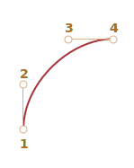

# CSS-анімації

CSS дозволяє робити прості анімації взагалі без JavaScript.

JavaScript можна використовувати для керування CSS-анімацією та покращення її, додавши зовсім трохи коду.

## CSS-переходи [#css-transition]

Ідея CSS-переходів дуже проста. Ми описуємо властивість і як саме її зміни мають бути анімовані. Коли властивість змінюється, браузер анімую цей перехід, тобто зміну значення.

Тобто все, що нам потрібно, це змінити властивість, а плавний перехід буде здійснюватися браузером.

Наприклад, наведений нижче CSS анімує зміни `background-color` протягом 3 секунд:

```css
.animated {
  transition-property: background-color;
  transition-duration: 3s;
}
```

Якщо елемент має клас `.animated`, будь-яка зміна `background-color` анімується протягом 3 секунд.

Натисніть кнопку нижче, щоб анімувати фон:

```html run autorun height=60
<button id="color">Натисни мене</button>

<style>
  #color {
    transition-property: background-color;
    transition-duration: 3s;
  }
</style>

<script>
  color.onclick = function() {
    this.style.backgroundColor = 'red';
  };
</script>
```

Є 4 властивості для опису переходів CSS:

- `transition-property`
- `transition-duration`
- `transition-timing-function`
- `transition-delay`

Зараз ми їх розглянемо, а поки зазначимо, що загальна властивість `transition` дозволяє оголошувати їх разом у порядку: `property duration timing-function delay`, а також анімувати декілька властивостей одночасно.

Наприклад, ця кнопка анімує `color` і `font-size` одночасно:  

```html run height=80 autorun no-beautify
<button id="growing">Натисни мене</button>

<style>
#growing {
*!*
  transition: font-size 3s, color 2s;
*/!*
}
</style>

<script>
growing.onclick = function() {
  this.style.fontSize = '36px';
  this.style.color = 'red';
};
</script>
```

Тепер розглянемо властивості анімації по черзі.

## transition-property

У `transition-property` ми пишемо список властивостей для анімації, наприклад: `left`, `margin-left`, `height`, `color`. Або можемо написати "all", що означає "анімувати всі властивості".

Зауважте, що є властивості, які не можна анімувати. Однак [більшість загальновживаних властивостей є анімаційними](https://developer.mozilla.org/en-US/docs/Web/CSS/CSS_animated_properties).

## transition-duration

У `transition-duration` задає, скільки часу має тривати анімація. Час має бути в [форматі часу CSS](https://www.w3.org/TR/css3-values/#time): в секундах `s` або мілісекундах `ms`.

## transition-delay

У `transition-delay` ми вказуємо затримку *перед* анімацією. Наприклад, якщо `transition-delay` дорівнює `1s`, а `transition-duration` - `2s`, то анімація починається через 1 секунду після зміни властивості, а загальна тривалість становитиме 2 секунди.  

Можливі й негативні значення. Тоді анімація відображається відразу, але початкова точка анімації буде після заданого значення (часу). Наприклад, якщо `transition-delay` дорівнює `-1s`, а `transition-duration` дорівнює 2с, то анімація починається з середини, а загальна тривалість становитиме 1 секунду.

Ця анімація переміщує числа з `0` на `9` за допомогою властивості `translate` CSS:

[codetabs src="digits"]

Властивість `transform` анімується так:

```css
#stripe.animate {
  transform: translate(-90%);
  transition-property: transform;
  transition-duration: 9s;
}
```

У наведеному вище прикладі JavaScript додає клас `.animate` до елемента -- і починається анімація:

```js
stripe.classList.add('animate');
```

Ми також могли б розпочати її десь із середини, точно вказавши число, напр. відповідно до поточної секунди, використовуючи негативне значення `transition-delay`.

Якщо ви зараз клацнете по цифрі -- анімація почнеться з поточної секунди:

[codetabs src="digits-negative-delay"]

JavaScript робить це за допомогою додаткового рядка:

```js
stripe.onclick = function() {
  let sec = new Date().getSeconds() % 10;
*!*
  // наприклад, -3s запускає анімацію з 3-ої секунди
  stripe.style.transitionDelay = '-' + sec + 's';
*/!*
  stripe.classList.add('animate');
};
```

## transition-timing-function

Функція часу описує, як процес анімації має розподілятися у часі. Наприклад, починається повільно, а потім іде швидко, чи навпаки.

Спочатку це здається найскладнішою властивістю. Але все стає дуже просто, якщо ми приділимо цьому трохи часу.

Ця властивість приймає два типи значень: крива Безьє або кроки. Почнемо з кривої, оскільки вона використовується частіше.

### Крива Безьє

Функцію часу можна встановити як [криву Безьє](/bezier-curve) з 4 контрольними точками, які задовольняють умовам:

1. Перша контрольна точка: `(0,0)`.
2. Остання контрольна точка: `(1,1)`.
3. Для проміжних точок значення `x` мають бути в інтервалі `0..1`, `y` може бути будь-яким.

Синтаксис кривої Без’є в CSS: `cubic-bezier(x2, y2, x3, y3)`. Тут нам потрібно вказати лише 2-гу і 3-тю контрольні точки, тому що 1-ша фіксована на `(0,0)`, а 4-та -- `(1,1)`.

Функція часу описує, швидкість процесу анімації.

- Вісь `x` -- це час, де `0` -- початок, `1` -- кінець `transition-duration`.
- Вісь `y` визначає завершення процесу, де `0` -- початкове значення властивості, `1` -- кінцеве.

Найпростіший варіант -- коли анімація йде рівномірно, з однаковою лінійною швидкістю. За допомогою кривої це можна визначити `cubic-bezier(0, 0, 1, 1)`.

Ось як виглядає ця крива:


...Як бачимо, це просто пряма лінія. З плином часу (`x`) завершення (`y`) анімації постійно змінюється від `0` до `1`.

Потяг у прикладі нижче рухається зліва направо з постійною швидкістю (клацніть по ньому):

[codetabs src="train-linear"]

Властивість `transition` заснована на цій кривій:

```css
.train {
  left: 0;
  transition: left 5s cubic-bezier(0, 0, 1, 1);
  /* натискаючи на потяг властивість left стає 450px, анімація запускається */
}
```

...А як ми можемо показати, що потяг гальмує?

Ми можемо використати іншу криву Без'є: `cubic-bezier(0.0, 0.5, 0.5 ,1.0)`.

Графік:



Як бачимо, процес починається швидко: крива злітає вгору, а потім все повільніше і повільніше.

Ось функція часу в дії (натисніть на потяг):

[codetabs src="train"]

CSS:
```css
.train {
  left: 0;
  transition: left 5s cubic-bezier(0, .5, .5, 1);
  /* натискаючи на потяг властивість left стає 450px, анімація запускається */
}
```

Існує кілька вбудованих кривих: `linear`, `ease`, `ease-in`, `ease-out` та `ease-in-out`.

`linear` скорочення від `cubic-bezier(0, 0, 1, 1)` -- пряма лінія, яку ми вже описували.

Інші назви є скороченнями наступних `cubic-bezier`:

| <code>ease</code><sup>*</sup> | <code>ease-in</code> | <code>ease-out</code> | <code>ease-in-out</code> |
|-------------------------------|----------------------|-----------------------|--------------------------|
| <code>(0.25, 0.1, 0.25, 1.0)</code> | <code>(0.42, 0, 1.0, 1.0)</code> | <code>(0, 0, 0.58, 1.0)</code> | <code>(0.42, 0, 0.58, 1.0)</code> |
|  |  |  |  |

`*` -- типово, якщо функція часу не встановлена, використовується `ease`.

Тож ми могли б використовувати `ease-out` для нашого потягу, що сповільнюється:

```css
.train {
  left: 0;
  transition: left 5s ease-out;
  /* те саме як transition: left 5s cubic-bezier(0, .5, .5, 1); */
}
```

Але виглядає це трохи інакше.

**Крива Безьє може змусити анімацію вийти за межі її діапазону.**

Контрольні точки на кривій можуть мати будь-які координати `y`: навіть негативні або величезні. Тоді крива Без'є також буде дуже низькою або високою, що змушує анімацію виходити за межі нормального діапазону.

У наведеному нижче прикладі код анімації:

```css
.train {
  left: 100px;
  transition: left 5s cubic-bezier(.5, -1, .5, 2);
  /* клік на потязі встановлює властивість left на 450px */
}
```

Властивість `left` має бути анімованою від `100px` до `400px`.

Але якщо ви клацнете по потягу, ви побачите, що:

- Спочатку потяг повертається *назад*: `left` стає меншим ніж `100px`.
- Потім він рухається вперед, трохи далі, ніж `400px`.
- А потім знову назад -- до `400px`.

[codetabs src="train-over"]

Чому це відбувається, стає зрозумілим, якщо ми подивимося на графік даної кривої Без'є:


Ми перемістили координату `y` 2-ої точки нижче нуля, а для 3-ої точки ми зробили її більше за `1`, тому крива виходить із "звичайного" квадранта. Координата `y` виходить за "стандартний" діапазон `0..1`.

Як відомо, `y` вимірює "завершення процесу анімації". Значення `y = 0` відповідає початковому значенню властивості, а `y = 1` -- кінцевому. Таким чином, значення `y<0` переміщує властивість за межі початкового `left` і `y>1` -- за останній `left`.

Це точно "м’який" варіант. Якщо ми введемо значення `y` як-от `-99` та `99` то потяг вискочить із діапазону значно більше.

Але як зробити криву Безьє для конкретного завдання? Інструментів багато. 

- Наприклад, ми можемо це зробити на сайті <https://cubic-bezier.com/>.
- Інструменти розробника браузера також мають спеціальну підтримку кривих Безьє в CSS:
    1. Відкрийте інструменти розробника за допомогою `key:F12` (Mac: `key:Cmd+Opt+I`).
    2. Виберіть вкладку `Elements`, тоді зверніть увагу на панель `Styles` праворуч.
    3. CSS властивості зі словом `cubic-bezier` матимуть значок перед цим словом.
    4. Натисніть цей значок, щоб редагувати криву.


### Кроки

Функція часу `steps(кількість кроків[, start/end])` дозволяє розділити перехід на кілька кроків.

Побачимо це на прикладі з цифрами.

Ось список цифр, без жодної анімації, просто як основа:

[codetabs src="step-list"]

У HTML смуга цифр укладена в `<div id="digits">` фіксованої довжини:

```html
<div id="digit">
  <div id="stripe">0123456789</div>
</div>
```

Div з `#digit` має фіксовану ширину та рамку, тому виглядає як червоне вікно.

Ми зробимо таймер: цифри будуть з'являтися одна за одною, дискретно.

Щоб досягти цього, ми приховаємо `#stripe` за межами `#digit` за допомогою `overflow: hidden`, а потім крок за кроком будемо переміщати `#stripe` ліворуч.

Буде 9 кроків, крок-хід для кожної цифри:

```css
#stripe.animate  {
  transform: translate(-90%);
  transition: transform 9s *!*steps(9, start)*/!*;
}
```

Першим аргументом `steps(9, start)` є кількість кроків. Перетворення буде розділено на 9 частин (по 10% кожна). Часовий інтервал також автоматично ділиться на 9 частин, тому `transition: 9s` дає нам 9 секунд на всю анімацію -- 1 секунда на цифру.

Другий аргумент -- це одне з двох слів: `start` чи `end`.

Значення `start` означає, що на початку анімації нам потрібно негайно зробити перший крок.

В дії:

[codetabs src="step"]

Клік на цифрі одразу змінює її на `1` (перший крок), а потім змінює на початку наступної секунди.

Процес іде так:

- `0s` -- `-10%` (перша зміна на початку 1-ої секунди, відразу)
- `1s` -- `-20%`
- ...
- `8s` -- `-90%`
- (остання секунда показує остаточне значення).

Тут перша зміна була миттєва через `start` у `steps`.

Альтернативне значення `end` означатиме, що зміну слід застосовувати не на початку, а в кінці кожної секунди.

Отже, процес для `steps(9, end)` буде виглядати так:

- `0s` -- `0` (протягом першої секунди нічого не змінюється)
- `1s` -- `-10%` (перша зміна в кінці 1-ої секунди)
- `2s` -- `-20%`
- ...
- `9s` -- `-90%`

Ось `steps(9, end)` в дії (зверніть увагу на паузу між зміною першої цифри):

[codetabs src="step-end"]

Існують також скорочені значення для `steps(...)`:

- `step-start` -- те саме, що й `steps(1, start)`. Тобто анімація починається відразу і займає 1 крок. Вона починається й закінчується одразу, ніби не було анімації.
- `step-end` -- те саме, що й `steps(1, end)`: зробіть анімацію за один крок у кінці `transition-duration`.

Ці значення рідко використовуються, тому що це насправді не анімація, а однокрокова зміна. Ми згадуємо їх тут для повноти.

## Подія: transitionend

Коли закінчується CSS анімація, запускається подія `transitionend`.

Вона широко використовується для виконання дії після завершення анімації. Також ми можемо обʼєднувати анімації з її допомогою.

Наприклад, якщо натиснути на корабель у наведеному нижче прикладі, він починає плисти туди й назад, щоразу все далі й далі праворуч:

[iframe src="boat" height=300 edit link]

Анімація ініціюється функцією `go`, яка повторно запускається кожного разу, коли закінчується перехід, і змінює напрямок на протилежний:

```js
boat.onclick = function() {
  //...
  let times = 1;

  function go() {
    if (times % 2) {
      // пливти праворуч
      boat.classList.remove('back');
      boat.style.marginLeft = 100 * times + 200 + 'px';
    } else {
      // пливти ліворуч
      boat.classList.add('back');
      boat.style.marginLeft = 100 * times - 200 + 'px';
    }

  }

  go();

  boat.addEventListener('transitionend', function() {
    times++;
    go();
  });
};
```

Об’єкт події для `transitionend` має кілька специфічних властивостей:

`event.propertyName`
: Властивість, яка завершила анімацію. Може бути корисна коли ми анімуємо кілька властивостей одночасно.

`event.elapsedTime`
: Час (у секундах), який тривала анімація, без `transition-delay`.

## Keyframes

Ми можемо об’єднати кілька простих анімацій разом за допомогою правила CSS `@keyframes`.

Воно визначає "ім’я" анімації та правила - що, коли і де анімувати. Використовуючи властивість `animation`, ми можемо приєднати анімацію до елемента та вказати додаткові параметри.

Ось приклад із поясненнями:

```html run height=60 autorun="no-epub" no-beautify
<div class="progress"></div>

<style>
*!*
  @keyframes go-left-right {        /* ім’я анімації: "go-left-right" */
    from { left: 0px; }             /* початок анімації від left: 0px */
    to { left: calc(100% - 50px); } /* кінець анімації до left: 100%-50px */
  }
*/!*

  .progress {
*!*
    animation: go-left-right 3s infinite alternate;
    /* застосувати анімацію "go-left-right" до елемента
       тривалість 3 секунди
       кількість разів: нескінченно
       щоразу змінювати напрямок
    */
*/!*

    position: relative;
    border: 2px solid green;
    width: 50px;
    height: 20px;
    background: lime;
  }
</style>
```

Є багато статей про `@keyframes` та [детальна специфікація](https://drafts.csswg.org/css-animations/).

Ймовірно, `@keyframes` не знадобиться вам часто, хіба якщо на ваших сайтах все постійно рухається.

## Продуктивність

Більшість властивостей CSS можна анімувати, оскільки більшість із них є числовими значеннями. Наприклад, `width`, `color`, `font-size` всі є числами. Коли ви анімуєте їх, браузер поступово змінює ці числа кадр за кадром, створюючи плавний ефект.

Однак не всі анімації виглядатимуть так гладко, як хотілося б, оскільки різні властивості змінюються по-різному.

Якщо говорити більше про технічні деталі, коли відбувається зміна стилю, браузер виконує 3 кроки для відтворення нового вигляду:

1. **Layout**: перерахувати геометрію, а потім положення кожного елемента
2. **Paint**: перерахувати, як все має виглядати на своїх місцях, включаючи фон, кольори,
3. **Composite**: відтворити кінцеві результати в пікселях на екрані, застосувати CSS-перетворення, якщо вони існують.

Під час CSS-анімації цей процес повторюється для кожного кадра. Однак властивості CSS, які ніколи не впливають на геометрію або положення, наприклад, `color`, можуть пропускатись крок Layout. Якщо `color` змінюється, браузер не обчислює нову геометрію, він переходить до кроків Paint -> Composite. І є кілька властивостей, які безпосередньо переходять до Composite. Ви можете знайти довший список властивостей CSS та на яких етапах вони запускаються тут <https://csstriggers.com>.

Обчислення може зайняти багато часу, особливо на сторінках із великою кількістю елементів і складною структурою. І затримки фактично помітні на більшості пристроїв, що призводить до "тремтіння", менш плавної анімації.

Анімація властивостей, які пропускають Layout крок, працюють швидше. Навіть ліпше, ніж коли пропускається крок Paint.

Властивість `transform` є чудовим вибором, оскільки:
- Перетворення CSS впливають на блок цільового елемента в цілому (повертають, перевертають, розтягують, зміщують його).
- CSS-перетворення ніколи не впливають на сусідні елементи.

...Тому браузери застосовують `transform` після наявних обчислень Layout та Paint на кроці Composite.

Іншими словами, браузер обчислює макет (розміри, положення), розфарбовує його за допомогою colors, background тощо на етапі Paint, а потім застосовує `transform` до елементів, які цього потребують.

Зміни (анімації) властивості `transform` ніколи не запускають кроки Layout та Paint. Більше того, браузер використовує графічний прискорювач (спеціальний чіп на ЦП або відеокарті) для CSS-перетворень, що робить їх дуже ефективними.

На щастя, властивість `transform` дуже потужна. Використовуючи `transform` для елемента, ви можете обертати та крутити його, розтягувати та зменшувати, переміщувати та [багато іншого](https://developer.mozilla.org/docs/Web/CSS/transform#syntax). Тому замість властивостей `left/margin-left` ми можемо використовувати `transform: translateX(…)`, `transform: scale` для збільшення розміру елемента тощо.

Властивість `opacity` ніколи не запускає Layout (в Mozilla Gecko також пропускається Paint). Ми можемо використовувати його для ефектів відображення/приховування або посилення/згасання.

Поєднання `transform` з `opacity` зазвичай може вирішувати більшість наших потреб, забезпечуючи плавну, яскраву анімацію.

<<<<<<< HEAD
Наприклад, тут клік на елемент `#boat` додає клас із `transform: translateX(300)` та `opacity: 0`, таким чином змушуючи його рухатись на `300px` праворуч і зникати:
=======
For example, here clicking on the `#boat` element adds the class with `transform: translateX(300px)` and `opacity: 0`, thus making it move `300px` to the right and disappear:
>>>>>>> 5e893cffce8e2346d4e50926d5148c70af172533

```html run height=260 autorun no-beautify


<style>
#boat {
  cursor: pointer;
  transition: transform 2s ease-in-out, opacity 2s ease-in-out;
}

.move {
  transform: translateX(300px);
  opacity: 0;
}
</style>
<script>
  boat.onclick = () => boat.classList.add('move');
</script>
```

Ось більш складний приклад із `@keyframes`:

```html run height=80 autorun no-beautify
<h2 onclick="this.classList.toggle('animated')">натисніть на мене, щоб почати/зупинити</h2>
<style>
  .animated {
    animation: hello-goodbye 1.8s infinite;
    width: fit-content;
  }
  @keyframes hello-goodbye {
    0% {
      transform: translateY(-60px) rotateX(0.7turn);
      opacity: 0;
    }
    50% {
      transform: none;
      opacity: 1;
    }
    100% {
      transform: translateX(230px) rotateZ(90deg) scale(0.5);
      opacity: 0;
    }
  }
</style>
```

## Підсумки

CSS-анімація дозволяє плавно (або покроково) анімувати зміну однієї або кількох властивостей CSS.

Це підходить для більшості задач. Ми також можемо використовувати JavaScript для анімації, цьому присвячений наступний розділ.

Обмеження анімації CSS порівняно з JavaScript:

```compare plus="CSS animations" minus="JavaScript animations"
+ Прості речі робляться просто.
+ Швидка та легка для процесора.
- Анімації JavaScript є гнучкими. Вони можуть реалізувати будь-яку логіку анімації, навіть "вибух" елемента.
- Не тільки властивості змінюються. В JavaScript ми можемо створювати нові елементи як частину анімації.
```

У перших прикладах цього розділу ми анімували `font-size`, `left`, `width`, `height` тощо. У реальних проектах ми повинні використовувати `transform: scale()` і `transform: translate()` для кращої продуктивності.

Більшість анімацій можна реалізувати за допомогою CSS, як описано в цьому розділі. А подія `transitionend` дозволяє запускати JavaScript після анімації, тому вона добре інтегрується з кодом.

Але в наступному розділі ми зробимо кілька анімацій JavaScript, щоб охопити більш складні випадки.
