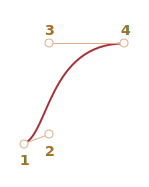

# CSS-анімації

CSS-анімація дає змогу робити прості анімації взагалі без JavaScript.

JavaScript можна використовувати для керування анімацією CSS та покращення її використовуючи трохи коду.

## CSS-переходи [#css-transition]

Ідея переходів CSS проста. Ми описуємо властивість і як її зміни мають бути анімовані. Коли властивість змінюється, браузер малює анімацію.

Тобто все, що нам потрібно, це змінити властивість, і плавний перехід буде здійснюватися браузером.

Наприклад, наведений нижче CSS анімує зміни `background-color` протягом 3 секунд:

```css
.animated {
  transition-property: background-color;
  transition-duration: 3s;
}
```

Якщо елемент має клас `.animated`, будь-яка зміна `background-color` анімується протягом 3 секунд.

Натисніть кнопку нижче, щоб анімувати фон:

```html run autorun height=60
<button id="color">Натисни мене</button>

<style>
  #color {
    transition-property: background-color;
    transition-duration: 3s;
  }
</style>

<script>
  color.onclick = function() {
    this.style.backgroundColor = 'red';
  };
</script>
```

Є 4 властивості для опису переходів CSS:

- `transition-property`
- `transition-duration`
- `transition-timing-function`
- `transition-delay`

Зараз ми їх розглянемо, а поки зазначимо, що загальна властивість `transition` дозволяє оголошувати їх разом у порядку: `property duration timing-function delay`, а також анімувати декілька властивостей одночасно.

Наприклад, ця кнопка анімує і `color`, і `font-size` одночасно:  

```html run height=80 autorun no-beautify
<button id="growing">Натисни мене</button>

<style>
#growing {
*!*
  transition: font-size 3s, color 2s;
*/!*
}
</style>

<script>
growing.onclick = function() {
  this.style.fontSize = '36px';
  this.style.color = 'red';
};
</script>
```

Тепер розглянемо властивості анімації по черзі.

## transition-property

У `transition-property` ми пишемо список властивостей для анімації, наприклад: `left`, `margin-left`, `height`, `color`. Або можемо написати "all", що означає "анімувати всі властивості".

Зауважте, що є властивості, які не можна анімувати. Однак [більшість загальновживаних властивостей є анімаційними](https://developer.mozilla.org/en-US/docs/Web/CSS/CSS_animated_properties).

## transition-duration

У `transition-duration` вказуємл, скільки часу має займати анімація. Час має бути в [форматі часу CSS](http://www.w3.org/TR/css3-values/#time): в секундах `s` або мілісекундах `ms`.

## transition-delay

У `transition-delay` ми вказуємо затримку *перед* анімацією. Наприклад, якщо `transition-delay` дорівнює `1s`, а `transition-duration` - `2s`, то анімація починається через 1 секунду після зміни властивості, а загальна тривалість становитиме 2 секунди.  

Можливі й негативні значення. Тоді анімація відображається відразу, але початкова точка анімації буде після заданого значення (часу). Наприклад, якщо `transition-delay` дорівнює `-1s`, а `transition-duration` дорівнює 2с, то анімація починається з середини, а загальна тривалість становитиме 1 секунду.

Ця анімація переміщує числа з `0` на `9` за допомогою властивості `translate` CSS:

[codetabs src="digits"]

Властивість `transform` анімується так:

```css
#stripe.animate {
  transform: translate(-90%);
  transition-property: transform;
  transition-duration: 9s;
}
```

У наведеному вище прикладі JavaScript додає клас `.animate` до елемента -- і починається анімація:

```js
stripe.classList.add('animate');
```

Ми також могли б розпочати її десь із середини, точного вказавши число, напр. відповідно до поточної секунди, використовуючи негативне значення `transition-delay`.

Якщо ви зараз клацнете цифру - анімація почеться з поточної секунди:

[codetabs src="digits-negative-delay"]

JavaScript робить це за допомогою додаткового рядка:

```js
stripe.onclick = function() {
  let sec = new Date().getSeconds() % 10;
*!*
  // наприклад, -3s запускає анімацію з 3-ї секунди
  stripe.style.transitionDelay = '-' + sec + 's';
*/!*
  stripe.classList.add('animate');
};
```

## transition-timing-function

Функція хронометражу описує, як процес анімації розподіляється по часовій шкалі. Почнеться повільно, а потім швидко, чи навпаки.

Спочатку це здається найскладнішою властивістю. Але все стає дуже просто, якщо ми приділимо цьому трохи часу.

Ця властивість приймає два види значень: крива Без'є або кроки. Почнемо з кривої, оскільки вона використовується частіше.

### Крива Без'є

Функцію хронометражу можна встановити як [криву Без'є](/bezier-curve) з 4 контрольними точками, які задовольняють умовам:

1. Перша контрольна точка: `(0,0)`.
2. Остання контрольна точка: `(1,1)`.
3. Для проміжних точок значення `x` мають бути в інтервалі `0..1`, `y` може бути будь-яким.

Синтаксис кривої Без'є в CSS: `cubic-bezier(x2, y2, x3, y3)`. Тут нам потрібно вказати лише 2-ю і 3-ю контрольні точки, тому що 1-а фіксована на `(0,0)`, а 4-а — `(1,1)`.

Функція часу описує, наскільки швидко проходить процес анімації.

- Вісь `x` - це час: `0` - початок, `1` - кінець `transition-duration`.
- Вісь `y` визначає завершення процесу: `0` -- початкове значення властивості, `1` -- кінцеве.

Найпростіший варіант – коли анімація йде рівномірно, з однаковою лінійною швидкістю. За допомогою кривої це можна визначити `cubic-bezier(0, 0, 1, 1)`.

Ось як виглядає ця крива:


...Як бачимо, це просто пряма лінія. З плином часу (`x`) завершення (`y`) анімації постійно змінюється від `0` до `1`.

Потяг у прикладі нижче рухається зліва направо з постійною швидкістю (натисніть):

[codetabs src="train-linear"]

Властивість `transition` заснована на цій кривій:

```css
.train {
  left: 0;
  transition: left 5s cubic-bezier(0, 0, 1, 1);
  /* натискаючи на поїзд властивість left стає 450px, анімація запускається */
}
```

...А як ми можемо показати, що потяг гальмує?

Ми можемо використати іншу криву Без'є: `cubic-bezier(0.0, 0.5, 0.5 ,1.0)`.

Графік:


Як бачимо, процес починається швидко: крива злітає вгору, а потім все повільніше.

Ось функція часу в дії (натисніть на потяг):

[codetabs src="train"]

CSS:
```css
.train {
  left: 0;
  transition: left 5s cubic-bezier(0, .5, .5, 1);
  /* натискаючи на поїзд властивість left стає 450px, анімація запускається */
}
```

Існує кілька вбудованих кривих: `linear`, `ease`, `ease-in`, `ease-out` та `ease-in-out`.

`linear` це скорочення від `cubic-bezier(0, 0, 1, 1)` -- пряма лінія, яку ми вже описували.

Інші назви є скороченнями наступних `cubic-bezier`:

| <code>ease</code><sup>*</sup> | <code>ease-in</code> | <code>ease-out</code> | <code>ease-in-out</code> |
|-------------------------------|----------------------|-----------------------|--------------------------|
| <code>(0.25, 0.1, 0.25, 1.0)</code> | <code>(0.42, 0, 1.0, 1.0)</code> | <code>(0, 0, 0.58, 1.0)</code> | <code>(0.42, 0, 0.58, 1.0)</code> |
|  |  |  |  |

`*` -- типово, якщо функція часу не встановлена, використовується `ease`.

Тож ми могли б використовувати `ease-out` для нашого потягу, що сповільнюється:


```css
.train {
  left: 0;
  transition: left 5s ease-out;
  /* те саме як transition: left 5s cubic-bezier(0, .5, .5, 1); */
}
```

Але виглядає це трохи інакше.

**Крива Без'є може змусити анімацію вийти за межі її діапазону.**

Контрольні точки на кривій можуть мати будь-які координати `y`: навіть негативні або величезні. Тоді крива Без'є також буде дуже низькою або високою, що змушує анімацію виходити за межі нормального діапазону.

У наведеному нижче прикладі код анімації:
```css
.train {
  left: 100px;
  transition: left 5s cubic-bezier(.5, -1, .5, 2);
  /* клік на потязі встановлює властивість left на 450px */
}
```

Властивість `left` має бути анімованою від `100px` до `400px`.

Але якщо ви клацнете потяг, ви побачите, що:

- Спочатку потяг повертається *назад*: `left` стає меншим ніж `100px`.
- Потім він рухається вперед, трохи далі, ніж `400px`.
- А потім знову назад -- до `400px`.

[codetabs src="train-over"]

Чому це відбувається, стає зрозумілим, якщо ми подивимося на графік даної кривої Без'є:


Ми перемістили координату `y` 2-ї точки нижче нуля, а для 3-ї точки ми зробили її на `1`, тому крива виходить із "звичайного" квадранта. Координата `y` виходить за "стандартний" діапазон `0..1`.

Як відомо, `y` вимірює "завершення процесу анімації". Значення `y = 0` відповідає початковому значенню властивості, а `y = 1` -- кінцевому. Таким чином, значення `y<0` переміщує властивість за межі початкового `left` і `y>1` -- за останній `left`.

Це точно "м'який" варіант. Якщо ми введемо значення `y` як-от `-99` та `99` то потяг вискочить із діапазону значно більше.

Але як зробити криву Без’є для конкретного завдання? Інструментів багато. Наприклад, ми можемо це зробити на сайті <http://cubic-bezier.com/>.

### Кроки

Функція часу `steps(кількість кроків[, start/end])` дозволяє розділити перехід на кілька кроків.

Побачимо це на прикладі з цифрами.

Ось список цифр, без жодної анімації, просто як джерело:

[codetabs src="step-list"]

Ми зробимо так, щоб цифри відображалися дискретно, роблячи частину списку за межами червоного «вікна» незримою та зміщуючи список ліворуч з кожним кроком.

Буде 9 кроків, крок-хід для кожної цифри:

```css
#stripe.animate  {
  transform: translate(-90%);
  transition: transform 9s *!*steps(9, start)*/!*;
}
```

В дії:

[codetabs src="step"]

Першим аргументом `steps(9, start)` є кількість кроків. Перетворення буде розділено на 9 частин (по 10% кожна). Часовий інтервал також автоматично ділиться на 9 частин, тому `transition: 9s` дає нам 9 секунд на всю анімацію – 1 секунда на цифру.

Другий аргумент - це одне з двох слів: `start` чи `end`.

Значення `start` означає, що на початку анімації нам потрібно негайно зробити перший крок.

Ми можемо бачити, що під час анімації: коли ми клацаємо по цифрі, вона відразу змінюється на `1` (перший крок), а потім змінюється на початку наступної секунди.

Процес протікає так:

- `0s` -- `-10%` (перша зміна на початку 1-ї секунди, відразу)
- `1s` -- `-20%`
- ...
- `8s` -- `-90%`
- (остання секунда показує остаточне значення).

Альтернативне значення `end` означатиме, що зміну слід застосовувати не на початку, а в кінці кожної секунди.

Отже, процес для `steps(9, end)` буде виглядати так:

- `0s` -- `0` (протягом першої секунди нічого не змінюється)
- `1s` -- `-10%` (перша зміна в кінці 1-ї секунди)
- `2s` -- `-20%`
- ...
- `9s` -- `-90%`

Ось `steps(9, end)` в дії (зверніть увагу на паузу між зміною першої цифри):

[codetabs src="step-end"]

Існують також скорочені значення:

- `step-start` -- те саме, що `steps(1, start)`. Тобто анімація починається відразу і займає 1 крок. Вона починається й закінчується одразу, ніби не було анімації.
- `step-end` -- те саме, що `steps(1, end)`: створіть анімацію за один крок у кінці `transition-duration`.

Ці значення рідко використовуються, тому що це насправді не анімація, а однокрокова зміна.

## Event transitionend

When the CSS animation finishes the `transitionend` event triggers.

It is widely used to do an action after the animation is done. Also we can join animations.

For instance, the ship in the example below starts to sail there and back when clicked, each time farther and farther to the right:

[iframe src="boat" height=300 edit link]

The animation is initiated by the function `go` that re-runs each time the transition finishes, and flips the direction:

```js
boat.onclick = function() {
  //...
  let times = 1;

  function go() {
    if (times % 2) {
      // sail to the right
      boat.classList.remove('back');
      boat.style.marginLeft = 100 * times + 200 + 'px';
    } else {
      // sail to the left
      boat.classList.add('back');
      boat.style.marginLeft = 100 * times - 200 + 'px';
    }

  }

  go();

  boat.addEventListener('transitionend', function() {
    times++;
    go();
  });
};
```

The event object for `transitionend` has a few specific properties:

`event.propertyName`
: The property that has finished animating. Can be good if we animate multiple properties simultaneously.

`event.elapsedTime`
: The time (in seconds) that the animation took, without `transition-delay`.

## Keyframes

We can join multiple simple animations together using the `@keyframes` CSS rule.

It specifies the "name" of the animation and rules - what, when and where to animate. Then using the `animation` property, we can attach the animation to the element and specify additional parameters for it.

Here's an example with explanations:

```html run height=60 autorun="no-epub" no-beautify
<div class="progress"></div>

<style>
*!*
  @keyframes go-left-right {        /* give it a name: "go-left-right" */
    from { left: 0px; }             /* animate from left: 0px */
    to { left: calc(100% - 50px); } /* animate to left: 100%-50px */
  }
*/!*

  .progress {
*!*
    animation: go-left-right 3s infinite alternate;
    /* apply the animation "go-left-right" to the element
       duration 3 seconds
       number of times: infinite
       alternate direction every time
    */
*/!*

    position: relative;
    border: 2px solid green;
    width: 50px;
    height: 20px;
    background: lime;
  }
</style>
```

There are many articles about `@keyframes` and a [detailed specification](https://drafts.csswg.org/css-animations/).

You probably won't need `@keyframes` often, unless everything is in constant motion on your sites.

## Performance

Most CSS properties can be animated, because most of them are numeric values. For instance, `width`, `color`, `font-size` are all numbers. When you animate them, the browser gradually changes these numbers frame by frame, creating a smooth effect.

However, not all animations will look as smooth as you'd like, because different CSS properties cost differently to change.

In more technical details, when there's a style change, the browser goes through 3 steps to render the new look:

1. **Layout**: re-compute the geometry and position of each element, then
2. **Paint**: re-compute how everything should look like at their places, including background, colors,
3. **Composite**: render the final results into pixels on screen, apply CSS transforms if they exist.

During a CSS animation, this process repeats every frame. However, CSS properties that never affect geometry or position, such as `color`, may skip the Layout step. If a `color` changes, the browser  doesn't calculate any new geometry, it goes to Paint -> Composite. And there are few properties that directly go to Composite. You can find a longer list of CSS properties and which stages they trigger at <https://csstriggers.com>.

The calculations may take time, especially on pages with many elements and a complex layout. And the delays are actually visible on most devices, leading to "jittery", less fluid animations.

Animations of properties that skip the Layout step are faster. It's even better if Paint is skipped too.

The `transform` property is a great choice, because:
- CSS transforms affect the target element box as a whole (rotate, flip, stretch, shift it).
- CSS transforms never affect neighbour elements.

...So browsers apply `transform` "on top" of existing Layout and Paint calculations, in the Composite stage.

In other words, the browser calculates the Layout (sizes, positions), paints it with colors, backgrounds, etc at the Paint stage, and then applies `transform` to element boxes that need it.

Changes (animations) of the `transform` property never trigger Layout and Paint steps. More than that, the browser  leverages the graphics accelerator (a special chip on the CPU or graphics card) for CSS transforms, thus making them very efficient.

Luckily, the `transform` property is very powerful. By using `transform` on an element, you could rotate and flip it, stretch and shrink it, move it around, and [much more](https://developer.mozilla.org/docs/Web/CSS/transform#syntax). So instead of `left/margin-left` properties we can use `transform: translateX(…)`, use `transform: scale` for increasing element size, etc.

The `opacity` property also never triggers Layout (also skips Paint in Mozilla Gecko). We can use it for show/hide or fade-in/fade-out effects.

Paring `transform` with `opacity` can usually solve most of our needs, providing fluid, good-looking animations.

For example, here clicking on the `#boat` element adds the class with `transform: translateX(300)` and `opacity: 0`, thus making it move `300px` to the right and disappear:

```html run height=260 autorun no-beautify


<style>
#boat {
  cursor: pointer;
  transition: transform 2s ease-in-out, opacity 2s ease-in-out;
}

.move {
  transform: translateX(300px);
  opacity: 0;
}
</style>
<script>
  boat.onclick = () => boat.classList.add('move');
</script>
```

Here's a more complex example, with `@keyframes`:

```html run height=80 autorun no-beautify
<h2 onclick="this.classList.toggle('animated')">click me to start / stop</h2>
<style>
  .animated {
    animation: hello-goodbye 1.8s infinite;
    width: fit-content;
  }
  @keyframes hello-goodbye {
    0% {
      transform: translateY(-60px) rotateX(0.7turn);
      opacity: 0;
    }
    50% {
      transform: none;
      opacity: 1;
    }
    100% {
      transform: translateX(230px) rotateZ(90deg) scale(0.5);
      opacity: 0;
    }
  }
</style>
```

## Summary

CSS animations allow smoothly (or step-by-step) animated changes of one or multiple CSS properties.

They are good for most animation tasks. We're also able to use JavaScript for animations, the next chapter is devoted to that.

Limitations of CSS animations compared to JavaScript animations:

```compare plus="CSS animations" minus="JavaScript animations"
+ Simple things done simply.
+ Fast and lightweight for CPU.
- JavaScript animations are flexible. They can implement any animation logic, like an "explosion" of an element.
- Not just property changes. We can create new elements in JavaScript as part of the animation.
```

In early examples in this chapter, we animate `font-size`, `left`, `width`, `height`, etc. In real life projects, we should use `transform: scale()` and `transform: translate()` for better performance.

The majority of animations can be implemented using CSS as described in this chapter. And the `transitionend` event allows JavaScript to be run after the animation, so it integrates fine with the code.

But in the next chapter we'll do some JavaScript animations to cover more complex cases.
