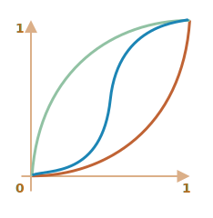

# JavaScript-анімації

JavaScript-анімації можуть робити те, що не під силу CSS.

Наприклад, рухати щось по складній траєкторії з функцією часу, відмінною від кривих Безьє, або створювати анімацію в елементі canvas.

## Використання setInterval

Анімація може бути реалізована як послідовність кадрів -- зазвичай це невеликі зміни у властивостях HTML/CSS.

Наприклад, зміна `style.left` з `0px` до `100px` переміщує елемент. А якщо ми збільшимо її в `setInterval`, змінюючи на `2px` з маленькою затримкою, наприклад, 50 разів на секунду, то це буде виглядати плавно. Це той самий принцип, що і в кіно: 24 кадрів на секунду достатньо, щоб все виглядало плавно.

Псевдокод може виглядати так:

```js
let timer = setInterval(function() {
  if (animation complete) clearInterval(timer);
  else increase style.left by 2px
}, 20); // змінюється на 2 пікселі кожні 20 мс, що приблизно 50 кадрів на секунду
```

Більш повний приклад анімації:

```js
let start = Date.now(); // зберігаємо час початку

let timer = setInterval(function() {
  // скільки часу пройшло від початку?
  let timePassed = Date.now() - start;

  if (timePassed >= 2000) {
    clearInterval(timer); // завершуємо анімацію через 2 секунди
    return;
  }

  // малюємо анімацію в момент часу timePassed
  draw(timePassed);

}, 20);

// коли timePassed змінюється від 0 до 2000
// left отримує значення від 0px до 400px
function draw(timePassed) {
  train.style.left = timePassed / 5 + 'px';
}
```

Клацніть, щоб побачити демо-версію:

[codetabs height=200 src="move"]

## Використання requestAnimationFrame

Уявімо, що у нас є кілька анімацій, запущених одночасно.

Якщо ми запустимо їх окремо, то навіть якщо кожен з них має `setInterval(..., 20)`, то браузеру доведеться перемальовувати набагато частіше, ніж кожні `20ms`.

Це тому, що вони мають різний час запуску, тому "кожні 20 мс" відрізняється для різних анімацій. Інтервали не вирівняні. Отже, ми матимемо кілька незалежних прогонів протягом `20ms`.

Іншими словами, це:

```js
setInterval(function() {
  animate1();
  animate2();
  animate3();
}, 20)
```

...легше, ніж три незалежні виклики:

```js
setInterval(animate1, 20); // незалежні анімації
setInterval(animate2, 20); // в різних місцях коду
setInterval(animate3, 20);
```

Ці кілька незалежних перемальовувань слід згрупувати разом, щоб зробити перемальовування простішим для браузера, а отже, зменшити навантаження на процесор і виглядати більш плавно.

Є ще одна річ, про яку слід пам'ятати. Іноді процесор перевантажений, або є інші причини перемальовувати рідше (наприклад, коли вкладку браузера приховано), тому нам дійсно не слід запускати його кожні `20ms`.

Але як дізнатися про це в JavaScript? Існує специфікація [Animation timing](https://www.w3.org/TR/animation-timing/), яка надає функцію `requestAnimationFrame`. Вона вирішує всі ці питання і навіть більше.

Синтаксис:
```js
let requestId = requestAnimationFrame(callback)
```

Це запланує запуск функції `callback` на найближчий час, коли браузер захоче виконати анімацію.

Якщо ми зробимо зміни в елементах у `callback`, то вони будуть згруповані разом з іншими викликами `requestAnimationFrame` і з CSS-анімаціями. Таким чином, буде виконано один перерахунок геометрії та перемальовування замість багатьох.

Повернуте значення `requestId` може бути використане для скасування виклику:
```js
// скасовуємо заплановане виконання колбеку
cancelAnimationFrame(requestId);
```

Функція `callback` отримує один аргумент -- час, що пройшов з початку завантаження сторінки в мілісекундах. Цей час також можна отримати за допомогою виклику [performance.now()](mdn:api/Performance/now).

Зазвичай `callback` виконується найближчим часом, якщо тільки процесор не перевантажений або батарея ноутбука майже розрядилася, або якщо є інший привід.

Код нижче показує час між першими 10 викликами для `requestAnimationFrame`. Зазвичай це 10-20 мс:

```html run height=40 refresh
<script>
  let prev = performance.now();
  let times = 0;

  requestAnimationFrame(function measure(time) {
    document.body.insertAdjacentHTML("beforeEnd", Math.floor(time - prev) + " ");
    prev = time;

    if (times++ < 10) requestAnimationFrame(measure);
  })
</script>
```

## Структурована анімація

Тепер ми можемо зробити більш універсальну функцію анімації на основі `requestAnimationFrame`:

```js
function animate({timing, draw, duration}) {

  let start = performance.now();

  requestAnimationFrame(function animate(time) {
    // timeFraction змінюється від 0 до 1
    let timeFraction = (time - start) / duration;
    if (timeFraction > 1) timeFraction = 1;

    // обчислюємо поточний стан анімації
    let progress = timing(timeFraction)

    draw(progress); // малюємо

    if (timeFraction < 1) {
      requestAnimationFrame(animate);
    }

  });
}
```

Функція `animate` приймає 3 параметри, які описують анімацію:

`duration`
: Загальний час анімації. Наприклад, `1000`.

`timing(timeFraction)`
: Функція часу, подібна до CSS-властивості `transition-timing-function`, яка отримує частку часу, що минув (`0` на початку, `1` в кінці) і повертає завершення анімації (як `y` на кривій Безьє).

    Наприклад, лінійна функція означає, що анімація триває рівномірно з однаковою швидкістю:

    ```js
    function linear(timeFraction) {
      return timeFraction;
    }
    ```

    Її графік:
    

    Це те саме, що й `transition-timing-function: linear`. Також існують цікавіші варіанти, показані нижче.

`draw(progress)`
: Функція, яка приймає стан завершення анімації і малює її. Значення `progress=0` означає початковий стан анімації, а `progress=1` -- кінцевий.

    Це та функція, яка фактично малює анімацію.

    Вона може переміщати елемент:
    ```js
    function draw(progress) {
      train.style.left = progress + 'px';
    }
    ```

    ...Або робити щось інше, ми можемо анімувати будь-що, у будь-який спосіб.


Давайте анімуємо `width` елемента від `0` до `100%` за допомогою нашої функції.

Натисніть на елемент для демонстрації:

[codetabs height=60 src="width"]

Код до неї:

```js
animate({
  duration: 1000,
  timing(timeFraction) {
    return timeFraction;
  },
  draw(progress) {
    elem.style.width = progress * 100 + '%';
  }
});
```

На відміну від CSS-анімацій, тут ми можемо створити будь-яку функцію часу і будь-яку функцію малювання. Функція часу не обмежується кривими Безьє. А `draw` може не тільки змінювати властивості елементів, а й створювати нові елементи, наприклад, для анімації феєрверків або чогось подібного.

## Функції часу (timing functions)

Вище ми бачили найпростішу, лінійну функцію часу.

Давайте розглянемо інші варіанти. Тут ми відтворимо анімацію руху з різними функціями часу, щоб побачити, як вони працюють.

### Степінь n

Якщо ми хочемо прискорити анімацію, ми можемо використати `progress` у степені `n`.

Наприклад, параболічна крива:

```js
function quad(timeFraction) {
  return Math.pow(timeFraction, 2)
}
```

Графік:


Побачити в дії (натисніть, щоб активувати):

[iframe height=40 src="quad" link]

...Або кубічна крива, або навіть ще більше значення `n`. Збільшення степеня призводить до швидшого прискорення.

Ось графік `progress` в степені `5`:


У дії:

[iframe height=40 src="quint" link]

### Дуга

Функція:

```js
function circ(timeFraction) {
  return 1 - Math.sin(Math.acos(timeFraction));
}
```

Графік:


[iframe height=40 src="circ" link]

### Back: стрільба з лука

Ця функція виконує "стрільбу з лука". Спочатку ми "натягуємо тятиву", а потім "стріляємо".

На відміну від попередніх функцій, вона залежить від додаткового параметра `x` -- "коефіцієнта еластичності". Саме ним визначається відстань "натягу тятиви".

Код:

```js
function back(x, timeFraction) {
  return Math.pow(timeFraction, 2) * ((x + 1) * timeFraction - x)
}
```

**Графік для `x = 1.5`:**.


Для анімації ми використовуємо його з певним значенням `x`. Приклад для `x = 1.5`:

[iframe height=40 src="back" link]

### Відскок

Уявіть, що ми кидаємо м'яч. Він падає вниз, потім кілька разів відскакує назад і зупиняється.

Функція `bounce` робить те саме, але у зворотному порядку: "відскакування" починається негайно. Для цього використовується декілька спеціальних коефіцієнтів:

```js
function bounce(timeFraction) {
  for (let a = 0, b = 1; 1; a += b, b /= 2) {
    if (timeFraction >= (7 - 4 * a) / 11) {
      return -Math.pow((11 - 6 * a - 11 * timeFraction) / 4, 2) + Math.pow(b, 2)
    }
  }
}
```

У дії:

[iframe height=40 src="bounce" link]

### Еластична анімація

Ще одна "еластична" функція, яка приймає додатковий параметр `x` для "початкового діапазону".

```js
function elastic(x, timeFraction) {
  return Math.pow(2, 10 * (timeFraction - 1)) * Math.cos(20 * Math.PI * x / 3 * timeFraction)
}
```

**Графік для `x=1.5`:**.


У дії для `x=1.5`:

[iframe height=40 src="elastic" link]

## Реверс: ease*

Отже, у нас є набір функцій часу. Їх пряме використання називається "easeIn".

Іноді нам потрібно показати анімацію у зворотному напрямку. Це робиться за допомогою трансформації "easeOut".

### easeOut

У режимі "easeOut" функція `timing` поміщається в обгортку `timingEaseOut`:

```js
timingEaseOut(timeFraction) = 1 - timing(1 - timeFraction)
```

Іншими словами, у нас є функція "перетворення" `makeEaseOut`, яка бере "звичайну" функцію часу і повертає обгортку навколо неї:

```js
// отримує функцію часу, повертає перетворений варіант
function makeEaseOut(timing) {
  return function(timeFraction) {
    return 1 - timing(1 - timeFraction);
  }
}
```

Наприклад, ми можемо взяти функцію `bounce`, описану вище, і застосувати її:

```js
let bounceEaseOut = makeEaseOut(bounce);
```

Тоді відскік буде не на початку, а в кінці анімації. Виглядає навіть краще:

[codetabs src="bounce-easeout"]

Тут ми бачимо, як перетворення змінює поведінку функції:


Якщо на початку є анімаційний ефект, наприклад, підстрибування -- він буде показаний в кінці.

На графіку вище <span style="color:#EE6B47">звичайний bounce</span> має червоний колір, а <span style="color:#62C0DC">easeOut bounce</span> -- синій.

- Звичайний bounce -- об'єкт відскакує внизу, а потім в кінці різко підстрибує догори.
- Після `easeOut` -- він спочатку стрибає вгору, а потім підстрибує там.

### easeInOut

Ми також можемо показати ефект як на початку, так і в кінці анімації. Така трансформація називається "easeInOut".

Знаючи функцію часу, ми обчислюємо стан анімації таким чином:

```js
if (timeFraction <= 0.5) { // перша половина анімації
  return timing(2 * timeFraction) / 2;
} else { // друга половина анімації
  return (2 - timing(2 * (1 - timeFraction))) / 2;
}
```

Код обгортки:

```js
function makeEaseInOut(timing) {
  return function(timeFraction) {
    if (timeFraction < .5)
      return timing(2 * timeFraction) / 2;
    else
      return (2 - timing(2 * (1 - timeFraction))) / 2;
  }
}

bounceEaseInOut = makeEaseInOut(bounce);
```

`bounceEaseInOut` в дії:

[codetabs src="bounce-easeinout"]

Трансформація "easeInOut" об'єднує два графіки в один: `easeIn` (звичайний) для першої половини анімації та `easeOut` (перевернутий) -- для другої частини.

Ефект добре видно, якщо порівняти графіки `easeIn`, `easeOut` та `easeInOut` функції часу `circ`:



- <span style="color:#EE6B47">Червоний</span> -- звичайний варіант `circ` (`easeIn`).
- <span style="color:#8DB173">Зелений</span> -- `easeOut`.
- <span style="color:#62C0DC">Синій</span> -- `easeInOut`.

Як бачимо, графік першої половини анімації -- це зменшений `easeIn`, а другої половини -- зменшений `easeOut`. В результаті анімація починається і закінчується з однаковим ефектом.

## Більш цікава функція "draw"

Замість переміщення елемента ми можемо зробити щось інше. Все, що нам потрібно, це написати правильну функцію `draw`.

Ось анімований текст, що "підстрибує" при наборі:

[codetabs src="text"]

## Підсумки

Анімації, з якими CSS не може впоратися, або ті, що потребують чіткого контролю, можуть бути реалізовані за допомогою JavaScript. JavaScript-анімація повинна бути реалізована через `requestAnimationFrame`. Цей вбудований метод дозволяє передавати колбек, що буде виконуватися, коли браузер буде готуватись до перемальовування. Зазвичай це відбувається дуже швидко, але точний час залежить від браузера.

Коли сторінка знаходиться у фоновому режимі, перемальовування взагалі не відбувається, тому колбек не запуститься: анімація буде призупинена і не буде споживати ресурси. І це чудово.

Ось допоміжна функція `animate` для налаштування більшості анімацій:

```js
function animate({timing, draw, duration}) {

  let start = performance.now();

  requestAnimationFrame(function animate(time) {
    // timeFraction змінюється від 0 до 1
    let timeFraction = (time - start) / duration;
    if (timeFraction > 1) timeFraction = 1;

    // обчислюємо поточний стан анімації
    let progress = timing(timeFraction);

    draw(progress); // малюємо

    if (timeFraction < 1) {
      requestAnimationFrame(animate);
    }

  });
}
```

Параметри:

- `duration` -- загальний час анімації у мілісекундах.
- `timing` -- функція для обчислення прогресу анімації. Отримує проміжок часу від 0 до 1, повертає прогрес анімації, зазвичай від 0 до 1.
- `draw` -- функція для малювання анімації.

Звичайно, ми могли б покращити її, додати більше наворотів, але JavaScript-анімації не застосовуються щодня. Вони використовуються для того, щоб зробити щось цікаве і нестандартне. Тому варто додавати функції, які вам потрібні, тоді, коли вони вам потрібні.

В JavaScript анімації можуть використовувати будь-яку функцію часу. Ми розглянули багато прикладів і трансформацій, щоб зробити їх ще більш універсальними. На відміну від CSS, тут ми не обмежуємося кривими Безьє.

<<<<<<< HEAD
Те ж саме стосується і функції `draw`: ми можемо анімувати будь-що, а не лише властивості CSS.
=======
The same is true about `draw`: we can animate anything, not just CSS properties.
>>>>>>> 5e893cffce8e2346d4e50926d5148c70af172533
