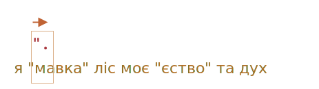
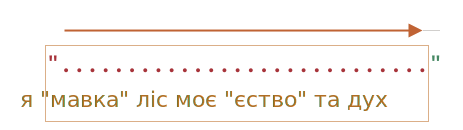
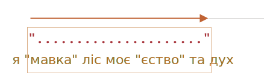

# Жадібні та ліниві квантифікатори

На перший погляд, квантифікатори не викликають питань, але насправді все не так просто.

Нам варто добре розуміти як працює пошук, якщо ми плануємо розглядати щось складніше за `pattern:/\d+/`.

Візьмемо за приклад наступну задачу.

Ми маємо текст та хочемо замінити всі лапки `"..."` на французькі лапки: `«...»`. Їм віддають перевагу у типографії у багатьох країнах.

Наприклад: `"Hello, world"` має перетворитись на `«Hello, world»`. Існують й інші види лапок, як-то `„Witam, świat!”` (польські) або `「你好，世界」` (китайські), але для нашої задачі виберемо `«...»`.

Для початку, знайдемо рядки в лапках, аби потім їх замінити.

Регулярний вираз по типу `pattern:/".+"/g` (лапки з чимось всередині) виглядає підходящим, але це не так!

Спробуємо його на практиці:

```js run
let regexp = /".+"/g;

let str = 'a "witch" and her "broom" is one';

alert( str.match(regexp) ); // "witch" and her "broom"
```

...Як бачимо, вираз працює не так, як очікувалось!

Замість двох збігів `match:"witch"` та `match:"broom"`, він знайшов один: `match:"witch" and her "broom"`.

Про це можна сказати "жадібність -- причина всіх бід".

## Жадібний пошук

Аби знайти збіг, рушій регулярних виразів використовує наступний алгоритм:

- Для кожної позиції в рядку
    - Спробувати виявити збіг на цій позиції.
    - Якщо збігу немає, перейти до наступної позиції.

Ці загальні фрази не пояснюють, чому регулярний вираз працює неправильно, тож розберемо, як пошук працює для шаблону `pattern:".+"`.

1. Першим символом шаблону є одна з лапок `pattern:"`.

    Рушій регулярного виразу намагається знайти його на нульовій позиції вихідного рядку `subject:a "witch" and her "broom" is one`, але бачить `subject:a`, тож одразу зрозуміло, що збігу нема.

    Йдемо далі: бере наступну позицію рядку та намагається на ній знайти перший символ шаблону, знову невдача, але, нарешті, необхідний символ знаходиться на третій позиції:

    

2. Першу з лапок виявлено, після цього рушій намагається знайти збіг для решти шаблону. Він намагається зрозуміти, чи відповідає решта рядка `pattern:.+"`.

    В нашому випадку, наступний символ шаблону -- це `pattern:.` (крапка). Він вказує на "будь-який символ, за винятком символу нового рядку", тож наступна літера рядку `match:'w'` підходить під опис:

    

3. Після цього, дія крапки повторюється через наявність квантифікатору `pattern:.+`. Рушій регулярних виразів додає до збігу символи один за одним.

    ...До якого моменту? Крапка приймає усі символи, таким чином зупиняючись тільки досягнувши кінця рядку:

    

4. Тепер рушій завершив повтори `pattern:.+` та намагається знайти наступний символ шаблону -- другу закриваючу лапку `pattern:"`. Але виникає проблема: рядок закінчився, символів більше немає!

    Рушій регулярних виразів розуміє, що взяв забагато `pattern:.+` та починає *повернення*.

    Іншими словами, він скорочує збіг для квантифікатора по одному символу:

    

    Після цього, рушій припускає, що `pattern:.+` завершується одним символом раніше кінця рядку та намагається знайти збіг для решти шаблону, починаючи з тієї позиції.

    Якби друга з лапок була на цьому місці, то пошук завершився б, але останній символ `subject:'e'` не відповідає цілі пошуку.

5. ...Тому рушій зменшує кількість повторів `pattern:.+` на ще один символ:

    

    Друга закриваюча лапка `pattern:'"'` не співпадає з `subject:'n'`.

6. Рушій продовжує процес повернення: число повторів `pattern:'.'` зменшується доти, доки решта шаблону (в цьому випадку, `pattern:'"'`) не збігається:

    

7. Збіг знайдено.

8. Отож, першим збігом буде:"witch" and her "broom"`. Якщо регулярний вираз має прапорець `pattern:g`, тоді пошук продовжиться з кінця першого збігу. Решта рядку `subject:is one` не містить лапок, тож інших збігів не буде.

Напевно, це не те, чого ми очікували, але так вже воно працює.

**В жадібному режимі (типово) квантифікований символ повторюється максимально можливу кількість разів.**

Рушій регулярного виразу додає до збігу всі можливі символи для `pattern:.+`, а потім зменшує результат посимвольно, якщо решта шаблону не збігається.

Наша задача потребує іншого підходу. Тут може стати в нагоді лінивий режим.

## Лінивий режим

Лінивий режим квантифікаторів є протилежним до жадібного режиму. Його алгоритм: "повторювати мінімальну кількість разів".

Ми можемо включити його, поставивши знак питання `pattern:'?'` після квантифікатора, і отримати  `pattern:*?`, `pattern:+?` чи навіть `pattern:??` для `pattern:'?'`.

Пояснимо кілька моментів: зазвичай, знак питання `pattern:?` сам по собі є квантифікатором (0 чи 1), але змінює значення, якщо його додати *після іншого квантифікатора (або навіть самого себе)* -- він змінює режим пошуку з жадібного на лінивий.

Регулярний вираз `pattern:/".+?"/g` працюватиме, як потрібно: він знайде `match:"witch"` та `match:"broom"`:

```js run
let regexp = /".+?"/g;

let str = 'a "witch" and her "broom" is one';

alert( str.match(regexp) ); // "witch", "broom"
```

Аби чітко побачити різницю, відслідкуємо процес пошуку покроково.

1. Перший крок той самий: знаходимо початок шаблону `pattern:'"'` на третій позиції:

    

2. Наступний крок теж подібний: рушій знаходить збіг для крапки `pattern:'.'`:

    

3. З цього моменту пошук йде іншим шляхом. Для `pattern:+?` включений лінивий режим, тож тепер рушій більше не намагається знайти збіг для крапки, зупиняється та намагається знайти збіг для решти шаблону `pattern:'"'`:

    

    Якби на цьому місці була остання з лапок, тоді пошук закінчився б, але бачимо `'i'`, тож збігу немає.
4. Далі, рушій регулярних виразів збільшує кількість повторів для крапки та ще раз проводить пошук:

    

    Знову невдача, тож кількість повторів крок за кроком збільшується...
5. ...До моменту знаходження збігу для решти шаблону:

    

6. Наступний пошук починається з кінця поточного збігу та приносить ще один результат:

    

В цьому прикладі, ми побачили, як працює лінивий режим для `pattern:+?`. Квантифікатори `pattern:*?` та `pattern:??` працюють за схожою схемою -- рушій регулярних виразів збільшує кількість повторень, тільки якщо решта шаблону не знаходить збігу на поточній позиції.

**Лінивий режим можна включити лише за допомогою `?`.**

Інші квантифікатори залишаються жадібними.

Для прикладу:

```js run
alert( "123 456".match(/\d+ \d+?/) ); // 123 4
```

1. Шаблон `pattern:\d+` намагається додати в збіг якомога більше цифр (жадібний режим), тож він знаходить `match:123` та зупиняється, тому що наступним йде пробіл `pattern:' '`.
2. Далі в шаблоні працює пробіл, відбувається збіг.
3. Після цього, маємо `pattern:\d+?`. Квантифікатор в лінивому режимі, тож він знаходить одну цифру `match:4` та, починаючи з цієї позиції, переходить до перевірки на збіг для решти шаблону.

    ...Але після `pattern:\d+?` в шаблоні нічого не залишилось.

    Лінивий режим не повторює нічого без потреби. Шаблон завершився, а з ним і наша робота. Ми знайшли збіг `match:123 4`.

```smart header="Optimizations"
Сучасні рушії регулярних виразів можуть оптимізовувати внутрішні алгоритми задля швидшої роботи. Тож їх алгоритм роботи може трішки відрізнятись від щойно описаного.

Але, для розуміння принципу побудови та роботи регулярних виразів, нам все це знати не обов’язково. Вони використовуються виключно внутрішньо для оптимізації.

Складні регулярні вирази погано піддаються оптимізації, тож пошук працюватиме саме так, як описано вище.
```

## Інший підхід

Працюючи з регулярними виразами, часто можна знайти декілька способів зробити одну й ту саму річ.

В нашому випадку, ми можемо знайти рядки в лапках без лінивого режиму, використовуючи `pattern:"[^"]+"`:

```js run
let regexp = /"[^"]+"/g;

let str = 'a "witch" and her "broom" is one';

alert( str.match(regexp) ); // "witch", "broom"
```

Регулярний вираз `pattern:"[^"]+"` дає правильні результати, бо шукає першу з лапок `pattern:'"'`, за якою слідують один чи більше символів (не лапок) `pattern:[^"]` та друга з лапок в кінці.

Коли рушій регулярних виразів шукає `pattern:[^"]+`, він припиняє повторення, як тільки зустрічає другу з лапок, на цьому все.

Зверніть увагу, цей спосіб не замінює ліниві квантифікатори!

Він просто інший. Різні ситуації потребують різні підходи.

**Розглянемо приклад, в якому ліниві квантифікатори помиляються, на відміну від другого варіанту.**

Скажімо, ми хочемо знайти посилання форми `<a href="..." class="doc">`, з будь-яким `href`.

Який регулярний вираз використати?

Першим на думку приходить: `pattern:/<a href=".*" class="doc">/g`.

Спробуємо:
```js run
let str = '...<a href="link" class="doc">...';
let regexp = /<a href=".*" class="doc">/g;

// Працює!
alert( str.match(regexp) ); // <a href="link" class="doc">
```

Спрацювало. Але подивимось, що станеться, якщо текст містить багато посилань?

```js run
let str = '...<a href="link1" class="doc">... <a href="link2" class="doc">...';
let regexp = /<a href=".*" class="doc">/g;

// Йой! Два посилання в одному збігу!
alert( str.match(regexp) ); // <a href="link1" class="doc">... <a href="link2" class="doc">
```

Тепер результат неправильний з тієї ж причини, що й у прикладі про "witches". Квантифікатор `pattern:.*` бере забагато символів.

Збіг виглядає наступним чином:

```html
<a href="....................................." class="doc">
<a href="link1" class="doc">... <a href="link2" class="doc">
```

Змінимо шаблон, зробивши квантифікатор `pattern:.*?` лінивим:

```js run
let str = '...<a href="link1" class="doc">... <a href="link2" class="doc">...';
let regexp = /<a href=".*?" class="doc">/g;

// Працює!
alert( str.match(regexp) ); // <a href="link1" class="doc">, <a href="link2" class="doc">
```

Ніби працює, маємо два збіги:

```html
<a href="....." class="doc">    <a href="....." class="doc">
<a href="link1" class="doc">... <a href="link2" class="doc">
```

...Але перевіримо на інших даних:

```js run
let str = '...<a href="link1" class="wrong">... <p style="" class="doc">...';
let regexp = /<a href=".*?" class="doc">/g;

// Хибна відповідь!
alert( str.match(regexp) ); // <a href="link1" class="wrong">... <p style="" class="doc">
```

Тепер він не працює, як ми хотіли. Збіг не обмежується посиланням, а містить також купу тексту, разом з `<p...>`.

Чому?

Ось процес виконання:

1. Спочатку, регулярний вираз знаходить початок посилання `match:<a href="`.
2. Далі, він шукає `pattern:.*?`: бере один символ (ліниво!), перевіряє наявність збігу для `pattern:" class="doc">` (немає).
3. Після того, перевіряє наступний символ відносно `pattern:.*?`, і так далі... доки він нарешті доходить до `match:" class="doc">`.

Але ось де проблема: він вже вийшов поза посилання `<a...>` в інший тег `<p>`. Зовсім не те.

Ось візуалізація збігу поруч з текстом:

```html
<a href="..................................." class="doc">
<a href="link1" class="wrong">... <p style="" class="doc">
```

Тож, шаблон має шукати `<a href="...something..." class="doc">`, але що жадібний, що лінивий варіанти мають проблеми.

Правильним варіантом може бути: `pattern:href="[^"]*"`. Він обере всі символи всередині атрибуту `href` до найближчих закриваючих лапок, саме те, що нам потрібно.

Коректний приклад:

```js run
let str1 = '...<a href="link1" class="wrong">... <p style="" class="doc">...';
let str2 = '...<a href="link1" class="doc">... <a href="link2" class="doc">...';
let regexp = /<a href="[^"]*" class="doc">/g;

// Працює!
alert( str1.match(regexp) ); // null, збігів немає, все правильно
alert( str2.match(regexp) ); // <a href="link1" class="doc">, <a href="link2" class="doc">
```

## Підсумки

Квантифікатори мають два режими роботи:

Жадібний
: Типово рушій регулярних виразів намагається повторити квантифікований символ максимально можливу кількість разів. Для прикладу, `pattern:\d+` обирає всі можливі цифри. Коли продовжити цей процес неможливо (більше немає цифр/кінець рядку), тоді продовжується пошук збігу для решти шаблону. Якщо збігу немає, він зменшує кількість повторень (повертається) та пробує наново.

Лінивий
: Включається знаком питання `pattern:?` після квантифікатору. Рушій намагається знайти збіг решти шаблону перед кожним повторенням квантифікованого символу.

Як бачимо, лінивий режим не є "панацеєю" від жадібного пошуку. Як альтернативу розглядають "добре налаштований" жадібний пошук, з виключенням, як в шаблоні `pattern:"[^"]+"`.
